---
## 목차

1. [네 개의 영역](##21-네-개의-영역)
2. [계층 구조 아키텍처](#22-계층-구조-아키텍처)
3. [DIP](#23-DIP)
4. [도메인 영역의 주요 구성요소](#24-도메인-영역의-주요-구성요소)
5. [요청 처리 흐름](#25-요청-처리-흐름)
6. [인프라스트럭처 개요](#26-인프라스트럭처-개요)
7. [모듈 구성](#27-모듈-구성)

---
## 2.1 네 개의 영역

**아키텍쳐의 영역을 크게 표현, 응용, 도메인, 인프라스트럭처 4개로 나눌 수 있다.**

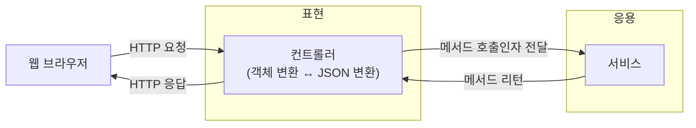

**표현 영역**: 사용자나 외부 요청을 받고 보내는 창구 
ex) 프론트 엔드, 백엔드 컨트롤러 계층(@Controller, @RestController, 요청/응답 DTO, 요청 검증, HTTP 상태코드 변환)

**응용 영역**: 사용자의 요청을 받아서 하나의 유스케이스를 실행하는 조정자
ex) 백엔드 서비스, 하지만 도메인 서비스는 아님. 흐름 조정을 담당 (트랜잭션 시작, 도메인 객체 조회, 도메인 매서드 호출, 저장, 외부 시스템 호출 순서 조정)

**도메인 영역**: 업무 규칙과 개념이 담긴 핵심
ex) 엔티티, value type, enum, 도메인 서비스, 도메인 이벤트, 리포지터리 인터페이스

**인프라스트럭처 영역**: DB, 메시지 브로커, 외부 API, 메일, 파일 저장소 같은 기술 구현체
ex) jpa repository 구현, mybatis mapper, kafka poducer/consumer, smtp 메일 발송기,
외부 api 클라이언트, redis 캐시 구현, s3 파일 저장 구현, 보안/암호화 구현, 로그/모니터링 연동
ex) curl을 사용하듯 http로 다른 시스템을 호출하는 것도 해당(외부 시스템과 통신 구현)

```
4개의 영역으로 나누는 이유는 입출력/흐름조정/업무핵심/기술구현 을 분리하기 위함이다.
```

**응용 영역 ex) 주문 취소 기능**
로직의 직접 수행보다 도메인 모델에 로직 수행을 위임
```java

public class CancelOrderService {
	@Transactional
	public void cancelOrder(String orderId) {
		Order order = findOrderById(orderId);
		if(order == null) throw new OrderNotFoundException(orderId);
		order.cancel();
	}
	...
}
```


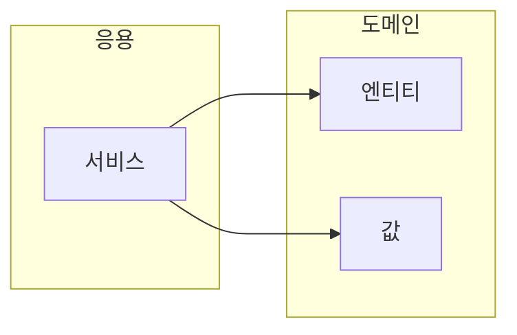


**도메인 영역은 도메인 모델을 구현한다.**
ex) 주문 도메인 - 배송지 변경, 결제 완료, 주문 총액 계산

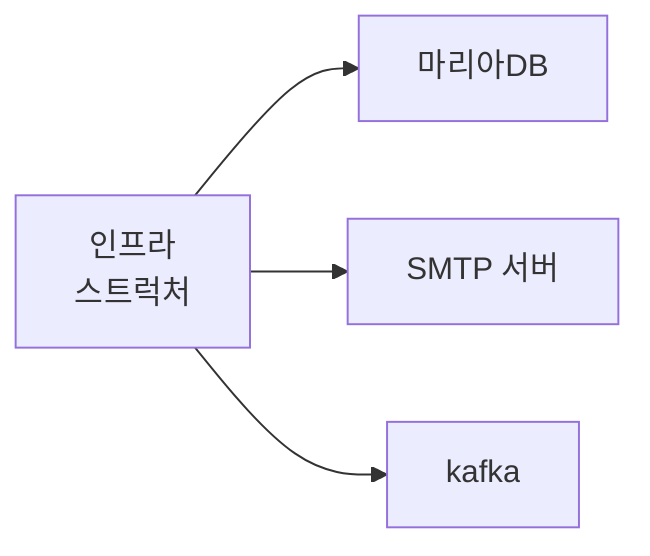

**인프라스트럭처 영역은 구현 기술에 대한 것을 다룬다.**
RDBMS 연동을 처리하고 메시징 큐에 메시지를 전송하거나 수신하는 기능을 구현하고, 몽고DB나 레디스의 데이터 연동을 처리한다.

---
## 2.2 계층 구조 아키텍처

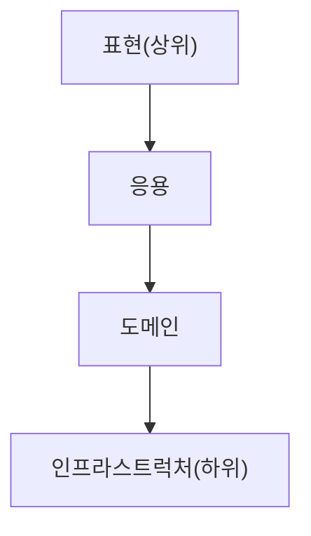

계층에 있어 상위는 하위 계층에 의존하지만 반대는 아니다.
좀 더 러프하게 구현하면 바로 하위가 아니더라도 의존하게 한다.

**계층 구조에 있어서 변화가 많은 쪽이, 변화가 적은 쪽에 의존해야 한다.** 하지만 표현 > 응용 > 도메인은 맞으나 인프라스트럭처도 표현 못지 않게 변화가 많이 일어난다. 하지만 도메인이 인프라스트럭처를 직접 알게 되면 도메인이 DB에 묶이면서 문제가 발생한다. (mongoDB에서 MySQL등으로 바뀔때마다 수정이 필요할 수 있다.)

```
도메인은 “무엇을 할지”만 알고  
인프라는 “어떻게 할지”를 담당

[의존 관계]
표현 -> 응용 -> 도메인 <- 인프라스트럭처
```


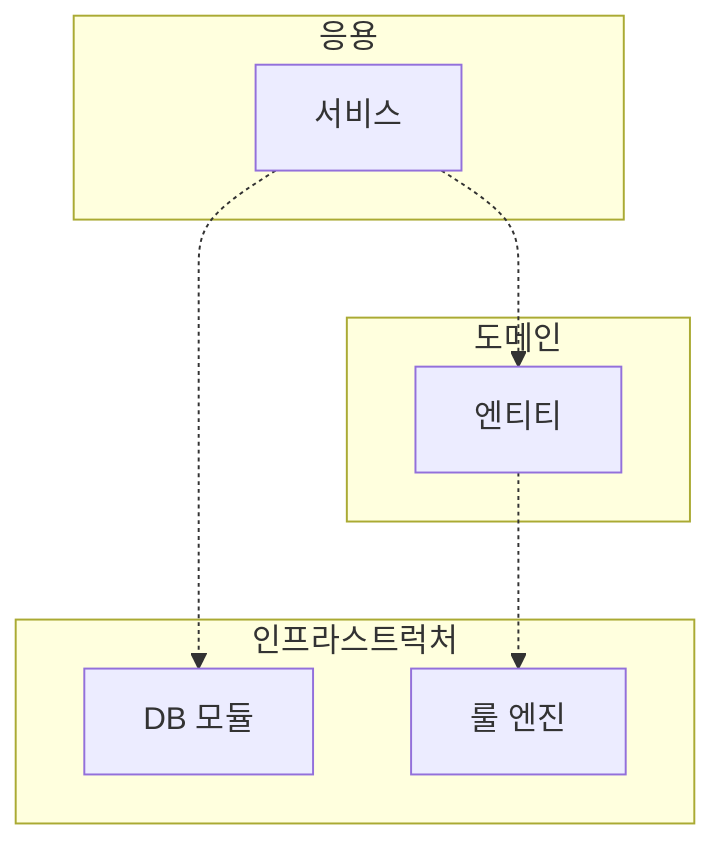

**인프라스트럭처 - 룰 엔진 "DroolsRuleEngine"**
```java
public class DroolsRuleEngine {
	private KieContainer kContainer;
	
	public DroolsRuleEngine() {
		KieService ks = KieService.Factory.get();
		kContainer = ks.getKieClasspathContainer();
	}
	
	public void evaluate(String sessionName, List<?> facts) {
		KieSession kSession = kContainer.newKieSession(sessionName);
		try {
			facts.forEach(x -> kSession.insert(x));
			kSession.fireAllRules();
		} finally {
			kSession.dispose();
		}
	}
}
```

**응용 - 서비스 "CalculateDiscountService"**
```java
public class CalculateDiscountService {
	private DroolsRuleEngine ruleEngine;
	
	//가격 계산을 위해 인프라스트럭처 영역을 사용
	// 문제 1. CalculateDiscountService만 테스트 불가
	// 문제 2. 구현 방식 변경의 어려움
	public CalculateDiscountService() {
		ruleEngine = new DroolsRuleEngine();
	}
	
	public Money calculateDiscount(List<OrderLine> orderLines, String customerId) {
		Customer customer = findCustomer(customerId);
		
		//Drools에 특화된 코드
		MutableMoney money = new MutableMoney(0); //연산 결과를 위해 추가한 타입
		List<?> facts = Arrays.asList(customer, money); //룰에 필요한 데이터(지식)
		facts.addAll(orderLines);//룰에 필요한 데이터(지식)
		ruleEngine.evaluate("discountCalculation", facts);//룰의 세션 이름
		return money.toImmutableMoney();
	}
}
```

하지만 이렇게 의존 형태가 형성되면
1. **테스트의 어려움.**
2. **기능 확장의 어려움**
의 문제가 존재하여 DIP로 해결한다.

---
## 2.3 DIP

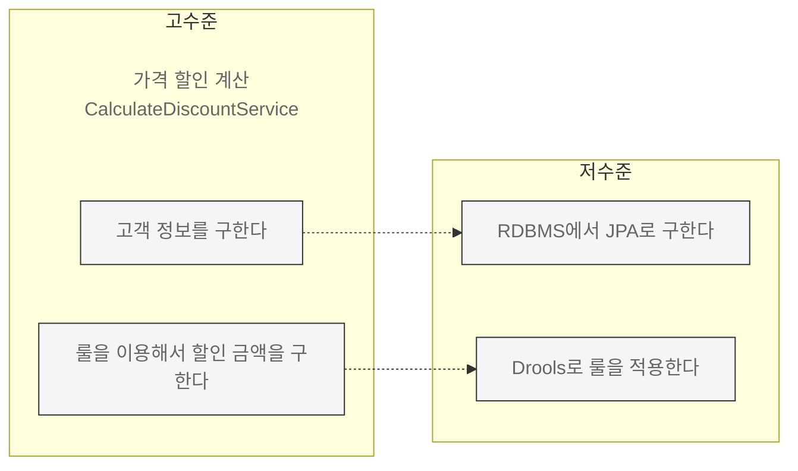

**고수준 모듈**은 **의미 있는 단일 기능을 제공**하는 모듈을 의미한다.
CalculateDiscountService의 경우 '가격 할인 계산'이라는 기능을 제공한다.

**저수준 모듈**은 **실제 구현한 것**을 의미한다.
단일 기능을 구현하기 위한 여러 하위 기능들이 있는데 저수준에서 구현된다.

고수준의 동작을 위해 저수준을 사용하는데 구현 변경과 테스트가 어려운 문제가 발생한다.

DIP는 저수준 모듈이 고수준 모듈에 의존하도록 바꾼다. (추상화 인터페이스를 사용)

```java
public interface RuleDiscounter {
	Money applyRules(Customer customer, List<OrderList> orderLines);
}
```

```java
public class CalculateDiscountService {
	private RuleDiscounter ruleDiscounter;
	private CustomerRepository customerRepository;
	
	public CalculateDiscountService(CustomerRepository customerRepository, RuleDiscounter ruleDiscounter) {
		this.ruleDiscounter = ruleDiscounter;
		this.customerRepository = customerRepository;
	}
	
	public Money calcuateDiscount(List<OrderLine> orderLines, String customerId) {
		Customer customer = findCustomer(customerId);
		return ruleDiscounter.applyRules(customer, orderLines); //룰에 의존하는 내용이 없음
	}
	
	private Customer findCustomer(String customerId) {
		Customer customer = customerRepository.findById(customerId);
		if(customer == null) throw new NoCustomerException();
		return customer;
	}
}
```

**RuleDiscounter를 상속받아 실제 rule을 구현**
```java
public class DroolsRuleDiscounter implements RuleDiscounter {
	private KieContainer kContainer;
	
	public DroolsRuleEngine() {
		KieService ks = KieService.Factory.get();
		kContainer = ks.getKieClasspathContainer();
	}
	
	@Override
	public Money applyRules(Customer customer, List<OrderLines> orderLines) {
		KieSession kSession = kContainer.newKieSession("discountSession");
		try {
			...
			kSession.fireAllRules();
		} finally {
			kSession.dispose();
		}
		
		return money.toImmutableMoney();
	}
}
```

고수준 : CalculateDiscountService, RuleDiscounter, CustomerRepository
저수준 : DroolsRuleDiscounter

이와 같이 고수준 모듈이 저수준 모듈이 의존하는 형태가 아닌, **저수준 모듈이 고수준 모듈에 의존한다 해서 DIP(Dependency Inversion Principle) 의존 역전 원칙**이라고 한다.

**구현 결과**
```java
RuleDiscounter ruleDiscounter = new DroolsRuleDiscounter():
CalculateDsicountService disService = new CalculateDiscountService(ruleDiscounter);


RuleDiscounter ruleDiscounter = new SimpleRuleDiscounter(): //구현체로 변경만 함
CalculateDsicountService disService = new CalculateDiscountService(ruleDiscounter); //변경 불필요
```

**테스트 코드**
```java
public class CalculateDiscountServiceTest {
	@Test
	public void noCustomer_thenExceptionShouldBeThrown() {
		//테스트 목적의 대역 객체
		CustomerRepository stubRepo = mock(CustomerRepository.class);
		when(stubRepo.findById("noCustId")).thenReturn(null);//noCustId면 null 반환
		
		RuleDiscounter stubRule = (cust, lines) -> null;
		
		//대용 객체를 주입 받아 테스트 진행
		CalculateDiscountService calDisSvc = new CalculateDiscountService(stubRepo, subRule);
		assertThrows(NoCustomerException.class, () -> calDisSvc.calculateDiscount(someLines, "noCustId")); //null을 반환받아 NoCustomerException을 강제 발생
	}
}
```

DIP를 오해하면 인터페이스와 구현 클래스로 받아들일 수 있다.

**잘못된 예시**
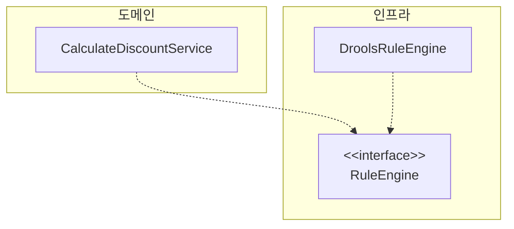

**올바른 예시**
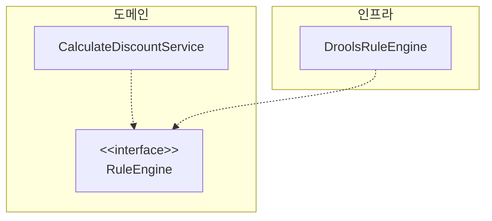

DIP를 항상 적용할 필요는 없으므로 DIP의 이점을 얻는 수준에서 적용 범위를 검토해 보자.

---
## 2.4 도메인 영역의 주요 구성요소

**도메인 영역의 주요 구성요소**

| 요소                        | 설명                                                                                        |
| ------------------------- | ----------------------------------------------------------------------------------------- |
| 엔티티<br>ENTITY             | - 고유의 식별자를 갖는 객체<br>- 자신의 라이프 사이클을 가짐<br>- 도메인의 고유한 개념을 표현<br>- 도메인 모델 데이터와 관련된 기능을 함께 제공 |
| 벨류<br>VALUE               | - 고유 식별자 X<br>- 개념적인 하나의 값 (주소, 돈 등)<br>- entity나 다른 value type의 속성으로 사용                  |
| 애그리거트<br>AGGREGATE        | - 연관된 엔티티와 벨류 객체를 개념적으로 묶은 것<br>- 주문 애그리거트 : Order entity, OrderLine value, Orderer value |
| 리포지터리<br>REPOSITORY       | - 도메인 모델의 영속성 처리<br>- DBMS에서 엔티티 객체를 로딩하거나 저장                                             |
| 도메인 서비스<br>DOMAIN SERVICE | - 특정 엔티티에 속하지 않은 도메인 로직을 제공<br>- '할인 금액 계산' 처럼 다양한 조건을 이용하게 될 경우                          |

DB 엔티티, 도메인 엔티티는 같지 않다.
도메인 모델의 엔티티 : 데이터와 함께 도메인 기능을 함께 제공
ex) 주문 - 주문 + 배송지 변경을 위한 기능

```java
public class Order {
	//주문 도메인 모델의 데이터
	private OrderNo number;
	private Orderer orderer;
	private ShippingInfo shippingInfo;
	
	//도메인 모델 엔티티는 도메인 기능도 함께 제공
	public void changeShippingInfo(ShippingInfo newShippingInfo) {
		...
	}
}

//두 개 이상의 데이터가 개념적으로 하나인 경우 Value Type으로 표현
public class Orderer {
	private String name;
	private String email;
}
```

RDBMS와 같은 관계형 데이터베이스는 Value Type을 제대로 표현하기 힘드므로 Orderer의 개별 데이터를 저장하거나 별도 테이블로 분리해서 저장한다.

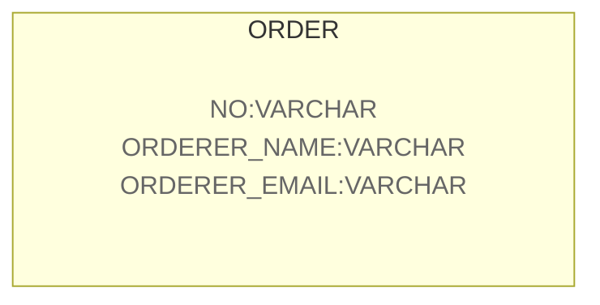

Orderer의 개별 데이터를 저장하므로 주문자라는 개념이 드러나지 않는다.

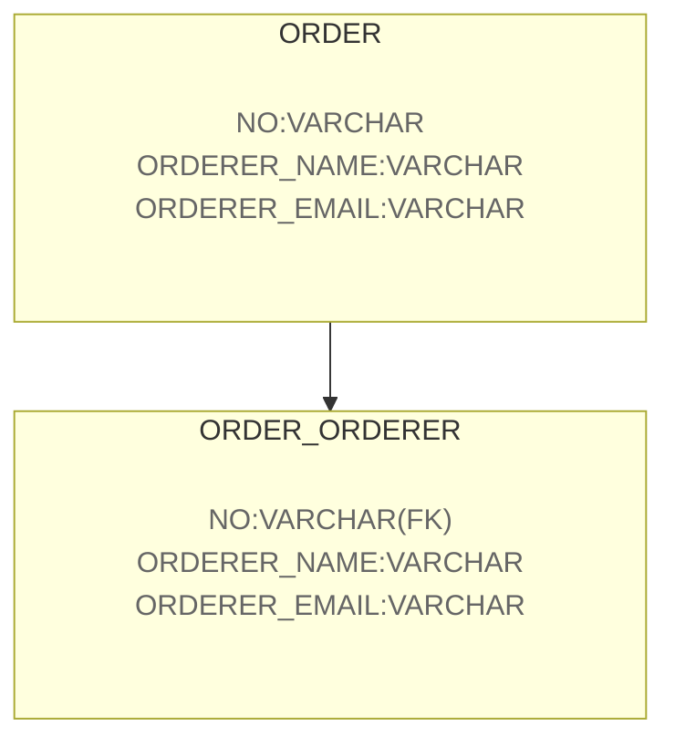
Oderer를 다른 table로 만들게 되면 테이블의 entity의 가깝고 Value Type의 의미가 드러나지 않는다. 하지만 주문자라는 개념을 잘 반영하므로 도메인을 보다 잘 이해할 수 있도록 돕는다.

Value는 불변으로 구현할 것을 권장하며 Value Type의 변경은 객체 자체를 완전히 교체한다는 것을 의미한다.
```java
public class Order {
	private ShippingInfo shippingInfo;
	
	//도메인 모델 엔티티는 도메인 기능도 함께 제공
	public void changeShippingInfo(ShippingInfo newShippingInfo) {
		checkShippingInfoChangeable(); //배송지 변경 가능 여부 확인
		setShippingInfo(newShippingInfo);
	}
	
	private void setShippingInfo(ShippingInfo newShippingInfo) {
		if(newShippingInfo == null) throw new IllegalArgumentException();
		//벨류 타입의 데이터를 변경할 때는 새로운 객체로 교체한다.
		this.shippingInfo = newShippingInfo;
	}
	
	private void checkShippingInfoChangeable() {
		//배송지 정보 변경할 수 있는지 여부를 확인하는 도메인 규칙 구현
		//아마 불가능 하면 exception을 던질 듯
	}
}
```

도메인 모델에서 **전체 구조를 이해하는데 도움이 되는 것이 애그리거트** 이다.
도메인이 커지면서 내부 entity와 value가 많아지고, 한개의 entity와 value에 집중하는 현상이 발생하는데, 이는 큰 수준에서 모델을 이해하지 못해 큰 틀에서 모델 관리를 할 수 없는 상황에 빠질 수 있다.

애그리거트는 군집에 속한 객체를 관리하는 **루트 엔티티**를 갖는다. 루트 엔티티는 에그리거트에 있는 엔티티와 밸류 객체를 이용해 구현해야 할 기능을 제공한다.

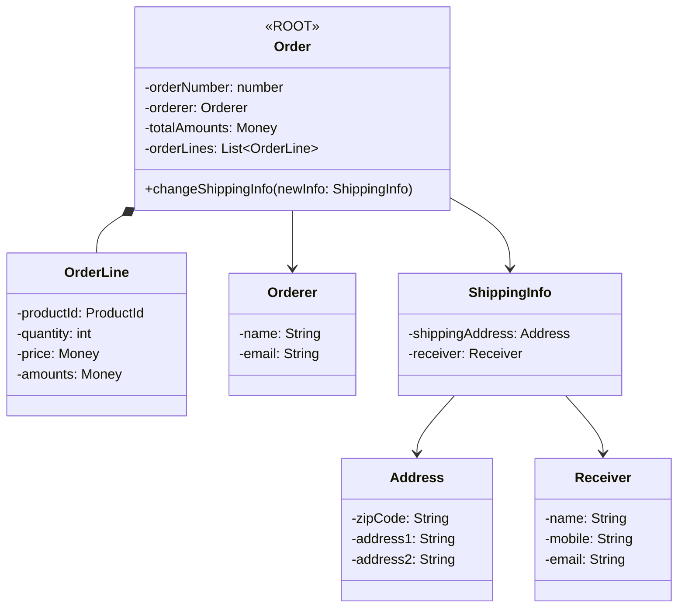

도메인 객체를 지속적으로 사용하기 위해 물리적인 저장소(RDBMS, NoSQL 등..)에 도메인 객체를 보관해야 한다. 이를 위한 도메인 모델이 리포지터리(Repository)이며 구현을 위한 모델이다.

리포지터리는 애그리거트 단위로 도메인 객체를 저장하고 조회하는 기능을 정의한다.
```java
public interface OrderRepository {
	Order findByNumber(OrderNumber number); //애그리거트 루트 식별자로 애그리거트를 조회하는 매서드
	void save(Order order); //애그리거트를 저장하는 메서드
	void delete(Order order);
}

public class CancelOrderService {
	Order order = orderRepository.findByNumber(number);
	if(order == null) throw new NoOrderException(number);
	order.cancel();
}
```

응용 서비스는 리포지터리와 밀접한 관련이 있다.
- **응용 서비스는 필요한 도메인 객체를 구하거나 저장할 때 리포지터리를 사용한다.**
- **응용 서비스는 트랜잭션을 관리하는데, 트랜잭션 처리는 리포지터리 구현 기술의 영향을 받는다.**

리포지터리는 응용 서비스가 필요로 하는 메서드를 제공한다.
- **애그리거트를 저장하는 메서드**
- **애그리거트 루트 식별자로 애그리거트를 조회하는 매서드**

---
## 2.5 요청 처리 흐름

요청 처리 흐름
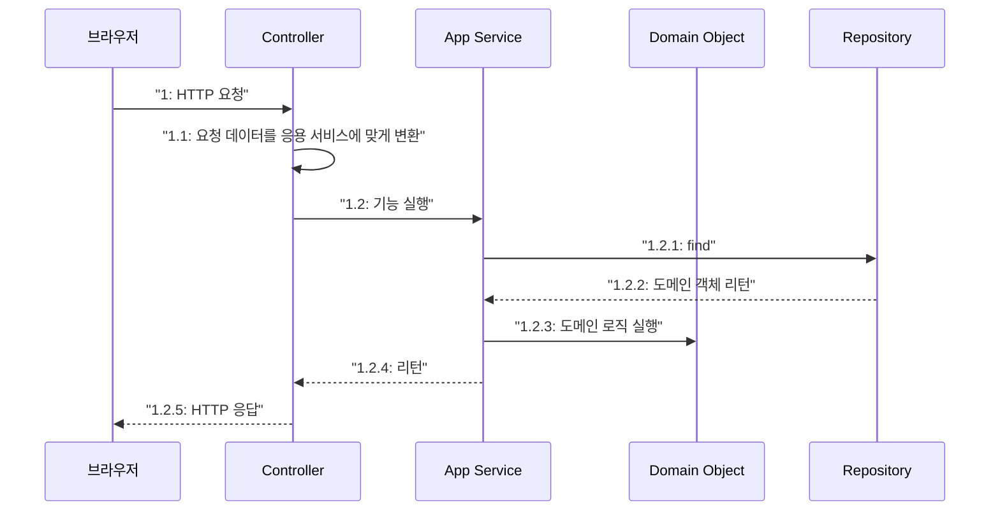

응용 서비스는 도메인의 상태를 변경하므로 물리 저장소에 올바르게 반영되도록 @Transactional 애너테이션을 이용한다.

```java
public class CancelOrderService {
	private OrderRepository orderRepository;
	
	@Transactional //응용 서비스는 트랜젝션을 관리한다.
	public void cancel(OrderNumber number) {
		Order order = orderRepository.findByNumber(number);
		if(order == null) throw new NoOrderException(number);
		order.cancel();
	}
}
```

---
## 2.6 인프라스트럭처 개요

인프라스트럭처는 표현 영역, 응용 영역, 도메인 영역을 지원한다.
또한 인프라스트럭처의 의존을 없앨 필요가 없는데 @Transactional과 같은 스프링에서 제공하는 서비스의 사용이 좋다. 

---
## 2.7 모듈 구성

아키텍처의 각 영역은 별도의 패키지에 위치한다.

영역별로 별도 패키지로 구성한 모듈 구조
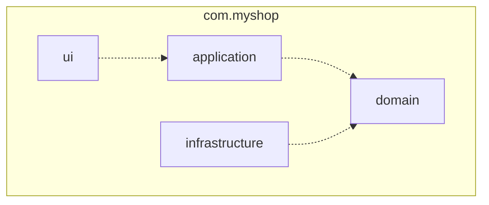

도메인이 크면 하위 도메인 별로 모듈을 나눈다.
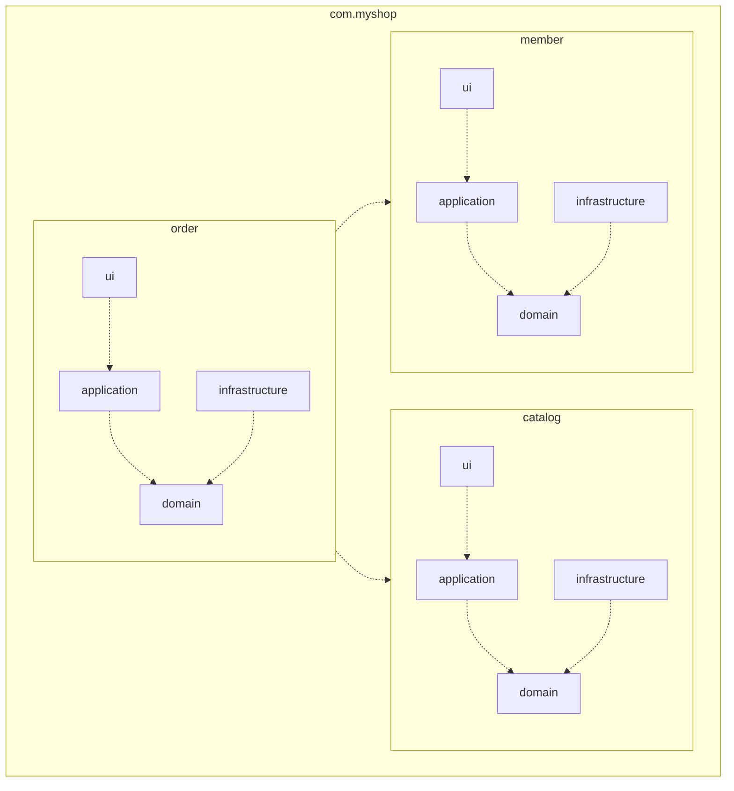


도메인은 도메인에 속한 애그리거트를 기준으로 다시 패키지를 구성한다.
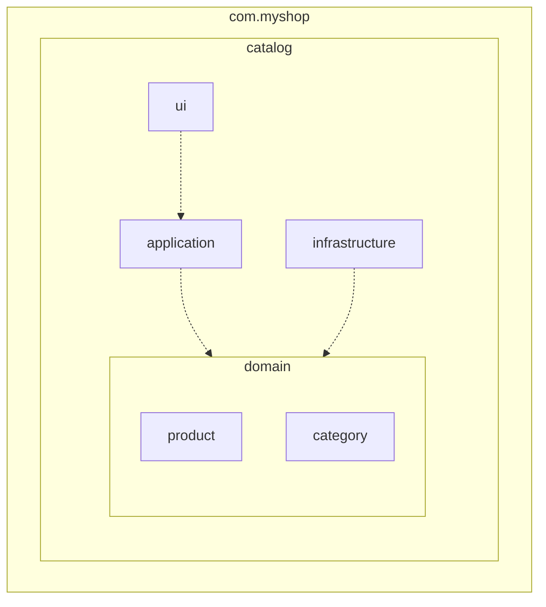

애그리거트, 모델, 리포지터리는 같은 패키지에 위치시킨다.
Order, OrderLine, Orderer, OrderRepository는 com.myshop.order.domain 패키지에 위치시킨다.

도메인이 복잡하면 도메인 모델과 서비스를 다음과 같이 별로 패키지에 위치시킬 수 있다.
애그리거트 : com.myshop.order.domain.order
도메인 서비스: com.myshop.order.domain.service

한 패키지에 10~14개의 개수를 유지하는게 좋다.
