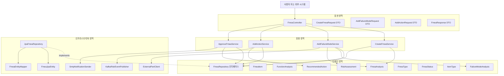
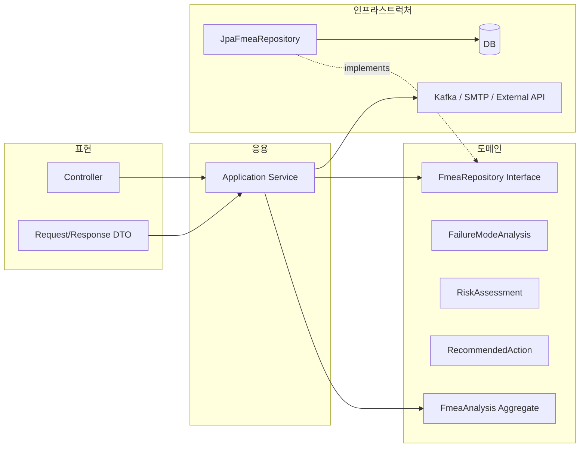
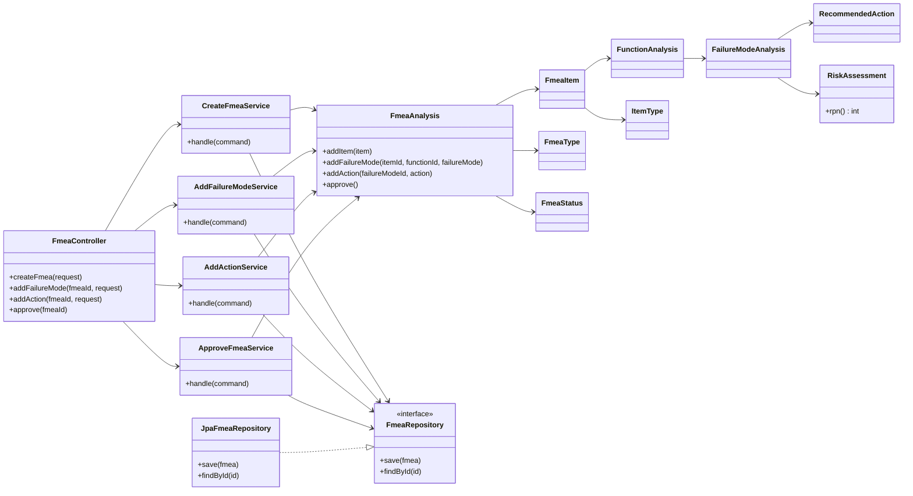

**FMEA의 유스케이스**
```
“FMEA 분석서를 생성하고, 실패모드와 위험평가를 등록하고, 개선조치를 추가한다.”
```

**표현 영역**
- `FmeaController`
- `CreateFmeaRequest`
- `AddFailureModeRequest`
- `AddActionRequest`
- `FmeaResponse`

**응용 영역**
- `CreateFmeaService`
- `AddFailureModeService`
- `AddActionService`
- `ApproveFmeaService`

**도메인 영역**
- `FmeaAnalysis`
- `FmeaItem`
- `FunctionAnalysis`
- `FailureModeAnalysis`
- `RecommendedAction`
- `RiskAssessment`
- `FmeaStatus`
- `FmeaType`
- `ItemType`
- `FmeaRepository 인터페이스`

**인프라스트럭처 영역**
- `JpaFmeaRepository`
- `FmeaJpaEntity`
- `FmeaEntityMapper`
- `KafkaRiskEventPublisher`
- `SmtpNotificationSender`
- `ExternalPartClient`
- `DB, Kafka, SMTP, 외부 PLM/QMS 연동 구현`



간단한 버전


---
**클래스 구조**



