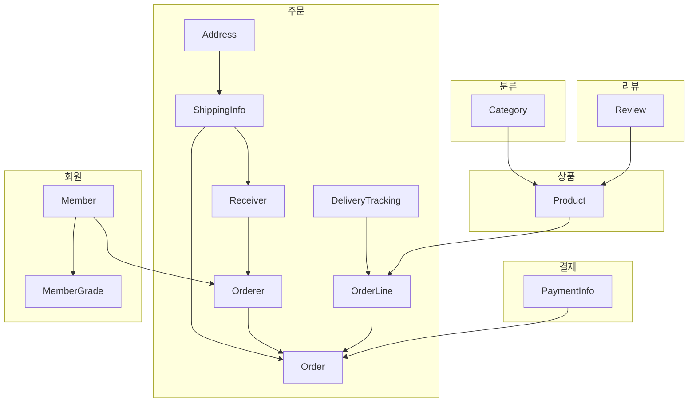
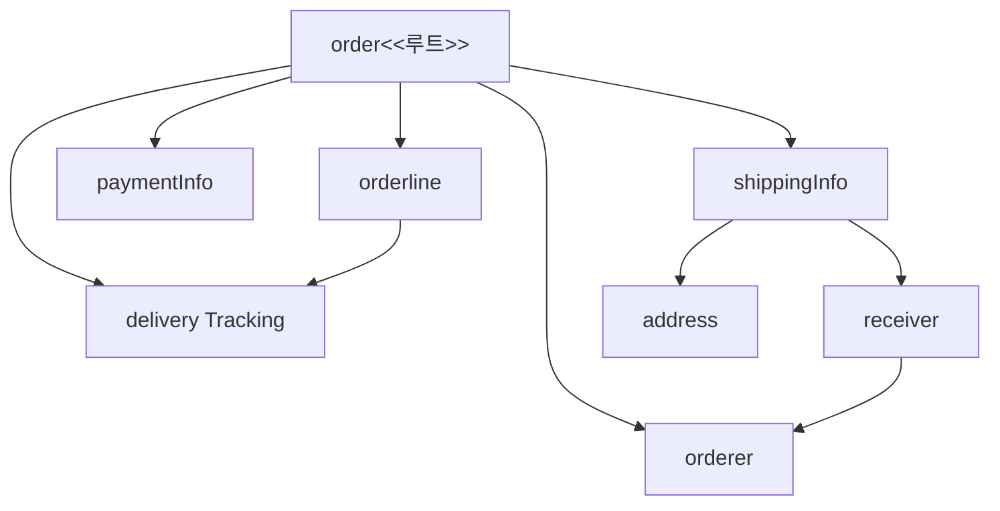

---
## 목차

1. [애그리거트](##31-애그리거트)
2. [애그리거트 루트](##32-애그리거트-루트)
3. [리포지터리와 애그리거트](##33-리포지터리와-애그리거트)
4. [ID를 이용한 애그리거트 참조](##34-ID를-이용한-애그리거트-참조)
5. [애그리거트 간 집합 연관](##35-애그리거트-간-집합-연관)
6. [애그리거트를 팩토리로 사용하기](##36-애그리거트를-팩토리로-사용하기)

---
## 3.1 애그리거트

복잡한 도메인을 이해하고 관리하기 쉬운 단위로 만들기 위해 상위 수준의 모델에서 조망할 수 있는 방법이다. 즉, 관련된 객체를 하나의 군으로 묶어 표현하는 방법이다.



관련된 모델을 하나로 모았기 때문에 애그리거트에 속한 개체는 유사하거나 동일한 라이프 사이클을 가진다. (애그리거트에 속한 구성 요소는 대부분 함께 생성하고 함께 제거한다.)

애그리거트는 경계를 갖고 중복으로 속하지 않는다. 독립된 개체 군으로 자기 자신만 관리하고 다른 애그리거트를 관리하진 않는다.

애그리거트의 경계를 설정하는 기본이 되는 것은 도메인 규칙과 요구사항이다.

---
## 3.2 애그리거트 루트

애그리거트에 속한 모든 객체가 일관된 상태를 유지하기 위해 애그리거트 전체를 관리하는 주체를 의미한다. 애그리거트의 대표 엔티티로 애그리거트에 속한 객체들은 직/간접적으로 속하게 된다.



애그리거트 루트의 핵심 역할은 **일관성을 유지**하는 것으로 애그리거트가 제공해야 할 도메인 기능을 구현한다. 

```java
public class Order {
	//애그리거트 루트는 도메인 규칙을 구현한 기능을 제공한다.
	public void changeShippingINfo(ShippingInfo newShippingInfo) {
		verifyNotYetShipped();
		setShippingInof(newShippingInfo);
	}
	
	//배송이 시작되기 전까지 배송지 정보를 변경할 수 있는 규칙에 따라 배송 시작 여부
	//를 확인하고 규칙을 충족할 때 배송지 정보를 변경하게 함.
	private void verifyNotYetShipped() {
		if(state != OrderState.PAYMENT_WAITING && state != OrderState.PREPARING) throw new IllegalStateException("already shipped");
	}
}
```

애그리거트는 외부에서 애그리거트에 속한 객체를 직접 변경하면 안 된다.
(아래는 올바르지 않은 형태와 중복 로직이 발생하는 방식의 형태이다.)
```java
//올바르지 않은 형태
ShippingInfo si = order.getShippingInfo();
si.setAddress(newAddress);

//논리적 데이터 일관성을 지키는 방법 - 주요 도메인 로직이 중복되는 문제
ShippingInfo si = order.getShippingInfo();

//주요 도메인 로직이 중복되는 문제
if(state != OrderState.PAYMENT_WAITING && state != OrderState.PREPARING) {
	throw new IllegalArgumentException();
}

si.setAddress(newAddress);
```

불필요한 중복을 피하고 에그리거트 루트를 통해서만 도메인 로직을 구현하게 만들려면 두 가지를 적용해야 한다.
- 단순히 필드를 변경하는 set 메서드를 공개(public) 범위로 만들지 않는다.
	-> 일관성이 깨질 가능성이 줄어들고 cancel, changePassword처럼 의미가 드러나는 이름을 사용하는 빈도가 높아진다.
- 밸류 타입은 불변으로 구현한다.
	-> 외부에서 내부 상태를 함부로 바꾸지 못하므로 애그리거트의 일관성이 깨질 가능성이 줄어든다.
	-> 변경을 위해서는 새로운 밸류 객체를 전달하는 방법 뿐이다.

```java
public class Order {
	private ShippingInfo shippingInfo;
	
	public void changeShippingInfo(ShippingInfo newShippingInfo) {
		verifyNotYetShipped();
		setShippingInfo(newShippingInfo);
	}
	
	//set 메서드의 접근 허용 범위는 private이다.
	private void setShippingInfo(ShippingInfo newShippingInfo) {
		//밸류가 불변이면 새로운 객체를 할당해서 값을 변경해야 한다.
		//불변이므로 this.shippingInfo.setAddress(newShippingInfo.getAddress())
		//와 같은 코드를 사용할 수 없다.
		this.shippingInfo = newShippingInfo;
	}
}
```
(이 때, set을 public하게 둔다면 항상 verifyNotYetShipped()를 작성해야 하는 번거로움이 존재한다. 잊을 경우에는 체크를 하지 않고 변경이 일어나기 때문에 일관성을 지키기 어렵다. 따라서 set을 private하게 생성한다.)

애그리거트 루트는 내부의 다른 객체를 조합해서 기능을 완성한다. (Order + OrderLine / Member + Password) 
구성 요소의 상태 뿐 아니라 기능 실행을 위임하기도 한다.

```java
public class OrderLines {
	private List<OrderLine> lines;
	
	public Money getTotalAmounts(); { /*...*/ }
	public void changeOrderLines(List<OrderLine> newLines) {
		this.lines = newLines;
	}
}

public class Order {
	private OrderLines orderLines;
	
	public void changeOrderLines(List<OrderLine> newLines) {
		orderLines.changeOrderLines(newLines);
		this.totalAmounts = orderLines.getTotalAmounts();
	}
}
```
Order가 외부에서 getOrderLines와 같이 orderlines를 구할 수 있는 메서드를 제공하면 애그리거트 외부에서 orderlines의 기능을 실행할 수 있다. 이 경우 주문의 orderline 목록은 바뀌는데 총합은 계산하지 않는 버그를 만들 수 있으므로 orderlines을 불변으로 구현하면 된다.

트랜잭션 범위는 작을 수록 좋다. 한 트랜잭션에는 한 개의 애그리거트만 수정을 해야 충돌 가능성이 적다. 부득이한 상황의 경우 응용 서비스에서 두 애그리거트를 수정하도록 구현한다.
```java
public class ChangeOrderService {
	//두 개 이상의 애그리거트를 변경해야 하면,
	//응용 서비스에서 각 애그리거트의 상태를 변경한다.
	@Transactional
	public void changeShippingInfo(OrderId id, ShippingInfo newShippingInfo, boolean useNewShippingAddrAsMemberAddr) {
		Order order = orderRepository.findbyId(id);
		if(order == null) throw new OrderNotFoundException();
		order.shipTo(newShippingInfo);
		if(useNewShippingAddrAsMemberAddr) {
		//다른 애그리거트의 상태를 변경하면 안됨
		//orderer.getMember().changeAddress(newShippingInfo.getAddress())
			Member member = findMember(order.getOrderer());
			member.changeAddress(newShippingInfo.getAddress());
		}
	}
}
```

---
## 3.3 리포지터리와 애그리거트

애그리거트는 개념상 한 개의 도메인 모델을 표현하므로 객체의 영속성을 처리하는 repository는 애그리거트 단위로 존재한다. (Order, Orderline 각각 X -> Order 만) 

애그리거트는 개념적으로 하나이므로 리포지터리는 애그리거트 전체를 저장소에 영속화해야한다. (애그리거트와 관련된 테이블이 3개라면 애그리거트를 저장할 때 애그리거트 루트와 매핑되는 테이블 뿐 아니라 속한 모든 구성요소에 매핑 된 테이블에 데이터를 저장해야 한다.)

```
OrderRepository 1개
	findbyId(id);
	save(order);
	
@Entity
public class Order {  
	@OneToMany(cascade = CascadeType.ALL) //연관된 엔티티까지 같이 persist
	private List<OrderLine> orderLines;  
}

@Entity
public class OrderLine {
	//...
}
```

---
## 3.4 ID를 이용한 애그리거트 참조

애그리거트 간의 참조는 필드를 통해 쉽게 구현할 수 있다.

```java
public class Order {
	private Orderer orderer;
	//...
}

public class Orderer {
	private Member member;
	private String name;
	//..
}

public class Member {
	//...
}

//회원 ID를 구하는 경우
order.getOrderer().getMember().getId();
```

이 경우 야기되는 문제가 3가지 있다.
- 편한 탐색 오용
- 성능에 대한 고민
- 확장 어려움

편한 탐색으로 인해 한 애그리거트에서 다른 애그리거트에 접근할 수 있으면 상태를 쉽게 변경할 수 있다.
애그리거트의 직접 참조시 성능과 관련된 여러 가지 고민을 해야 한다. 전체 조회시 eager(즉시), 불필요한 정보가 포함되었다면 lazy(지연) 등을 사용하는 JPQL/Criteria 쿼리의 로딩 전략을 결정해야 한다.
도메인으로 분리하면서 각각 다른 DB를 사용하는 경우도 발생해 JPA와 같은 단일 기술을 사용할 수 없을 수 있다.

위와 같은 문제를 완화하기 위해 ID를 이용해서 다른 애그리거트를 참조하는 것이다.
```java
public class Order {
	private Orderer orderer;
	//...
}

public class Orderer {
	private MemberId memberId; //Member를 직접 가지고 오지 않고 Member의 MemberId만 들고 있음
	private String name;
	//..
}

public class Member {
	private MemberId id;
	//...
}

//회원 ID를 구하는 경우
order.getOrderer().getMember().getId();
```

필요한 애그리거트만 로딩하므로 지연 로딩과 동일한 결과를 만든다.

ID로 참조할 경우 여러 애그리거트를 읽을 때 조회 속도가 문제 될 수 있다.
'조회 대상이 N개일 때 N개를 읽어오는 한 번의 커리와 연관된 데이터를 읽어오는 쿼리를 N번 실행한다' 는 N+1 조회 문제가 생길 수 있다.
조회 전용 쿼리를 사용하면 된다.
```java
// 별도의 DAO를 만들고 DAO의 조회 매서드에서 조인을 이용해 한 번의 쿼리로 필요한 데이터를 //로딩

@Repository
public class JpaOrderViewDao implements OrderViewDao {
	@PersistenceContext
	private EntityManager em;
	
	@Override
	public List<OrderView> selectByOrder(String orderId) {
		String selectQuery =
			"select new com.myshop.order.application.dto.OrderView(o, m, p) " |
			"from Order o join o.orderLines ol, Member m, Product p " +
			"where o.orderer.memberId.id = :ordererId " +
			"and o.orderer.memberId = m.id " +
			"and index(ol) = 0 " +
			"and ol.productId = p.id " +
			"order by o.number.number desc";
		TypedQuery<OrderView> query = em.createQuery(selectQuery, OrderView.class);
		query.setParameter("ordererId", ordererId);
		return query.getResultList();
	}
}
```

서로 다른 저장소를 사용한다면 캐시를 적용하거나 조회 전용 저장소를 따로 구성해야한다.

---
## 3.5 애그리거트 간 집합 연관

1-N, M-N 연관은 컬렉션을 이요한 연관이다.

(카테고리-상품 = 1-N)
애그리거트 간 1-N 관계는 Set과 같은 컬렉션을 이용해서 표현할 수 있다.
```java
public class Category {
	private Set<Product> products; //다른 애그리거트에 대한 1-N 연관
	
	public List<Product> getProducts(int page, int size);
	List<Product> sortedProducts = sortById(products);
	return sortedProducts.subList((page - 1) * size, page * size);
}
```

Category에 속한 모든 Product를 조회하게 되며 실행 속도가 급격히 느려질 수 있다. 개념적으로 1-N의 연관이 있더라도 성능 문제 때문에 실제 구현에 반영하지 않는다.

카테고리에 속한 상품을 구하기 위해 N-1로 연관 지어 구한다.
```java
public class Product {
	private CategoryId categoryId;
}
```

카테고리에 속산 상품 목록을 제공하는 응용 서비스는 categoryId가 지정한 카테고리 식별자인 Product 목록을 구한다.
```java
public class ProductListService {
	public Page<Product> getProductOfCategory(Long categoryId, int page, int size) 
	{
		Category category = categoryRepository.findById(categoryId);
		checkCategory(category);
		List<Product> products = 
		productRepository.findByCategoryId(categoryId.getId(), page, size);
		int totalCount = productRepository.countsByCategoryId(category.getId());
		return new Page(page, size, totalCount, products);
	}
}
```


M-N 연관은 개념적으로 양쪽 애그리거트에 컬렉션으로 연관을 만들지만 구현은 1-N처럼 고려한다. (실제로는 단방향이 될 수도 있다.)
```java
	public class Product {
		private Set<CategoryId> categoryIds;
	}
	
	@Entity
	@Table(name="product")
	public class Product {
		@EmbeddedId
		private ProductId id;
		
		@ElementCollection
		@CollectionTable(name="product_category", joinColumns=@JoinColumn(name="product_id"))
		private Set<CategoryId> categoryIds;
	}
	
	@Repository
	public class JpaProductRepository implements ProductsRepository {
		@PerisistenceContext
		private EntityManger entityManager;
		
		@Override
		public List<Product> findByCategoryId(CategoryId catId, int page, int size)
		{
			TypedQuery<Product> query = entityManger.createQuery(
				"select p from Product p " +
				//컬랙션에 catId로 지정한 값이 존재하는지 검사하기 위한 검색 조건
				"where :catId memeber of p.categoryIds order by p.id.id desc",
				Product.class	
			);
			
			query.setParameter("catId", catId);
			query.setFirstResult((page-1) * size);
			query.setMaxResults(size);
			return query.getResultList();
		}
	}
```

---
## 3.6 애그리거트를 팩토리로 사용하기

```java
public class RegisterProductService {
	public ProductId registerNewProduct(NewProductRequest req) {
		Store store = storeRepository.findById(req.getStoreId());
		checkNull(store);
		
		/* Product가 생성 가능한지 확인하고 생성하는 코드가 분리되어 있음
			논리적으로 하나의 도메인 기능인데 응용 서비스에서 구현중임임
		*/
		if(store.isBlocked()) {
			throw new StoreBlockedException();
		}
		ProductId id = productRepository.nextId();
		Product product = new Product(id, store.getId(),...);
		/**/
		
		productRepository.save(product);
		return id
	}
}
```

store 애그리거트에 Product 생성 기능을 옮겨서 코드를 생성한다.
```java
//store 애그리거트에 Product 기능을 옮겨 팩토리화 한다.
public class Store {
	public Product createProduct(ProductId newProductId, ...) {
		if(isBlocked()) throw new StoreBlockedException();
		return new Product(newProductId, getId(), ...);
		//혹은 다른 팩토리에 넘겨도 된다.
		//return ProductFactory.create(newProductId, getId(), pi); 
	}
}

public class RegisterProductService {
	public ProductId registerNewProduct(NewProductRequest req) {
		Store store = storeRepository.findById(req.getStoreId());
		checkNull(store);
		
		ProductId id = productRepository.nextId();
		//더 이상 store의 상태를 확인하지 않음
 		ProductId id = createProduct(id) 
		Product product = new Product(id, store.getId(),...);
		
		productRepository.save(product);
		return id
	}
}
```

---
