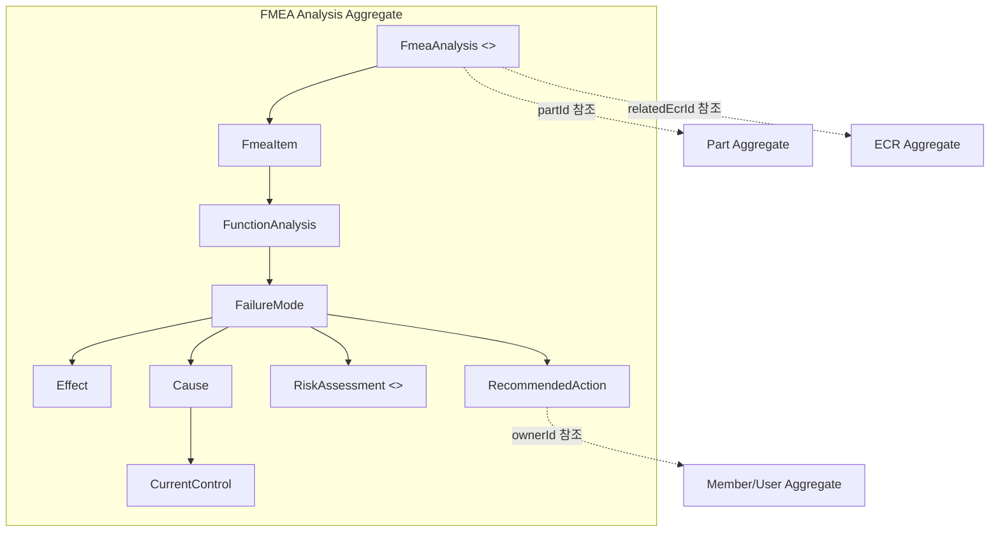
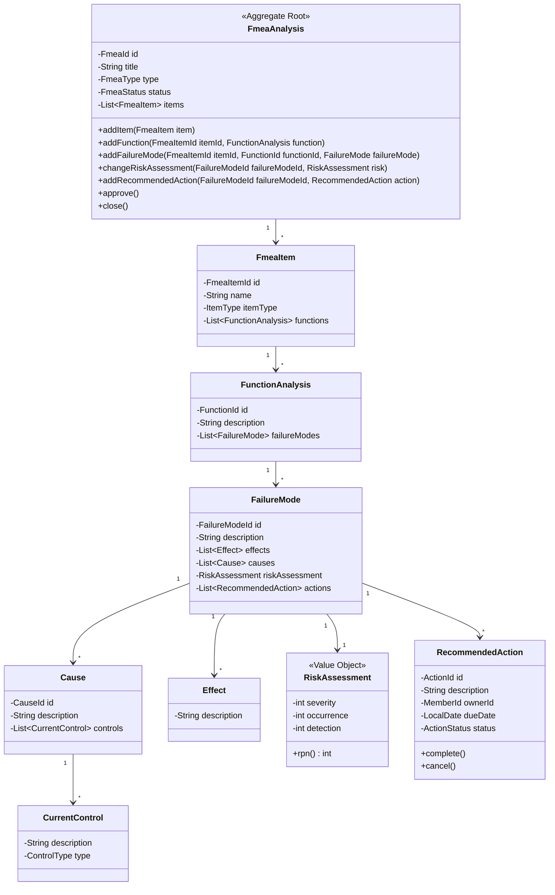
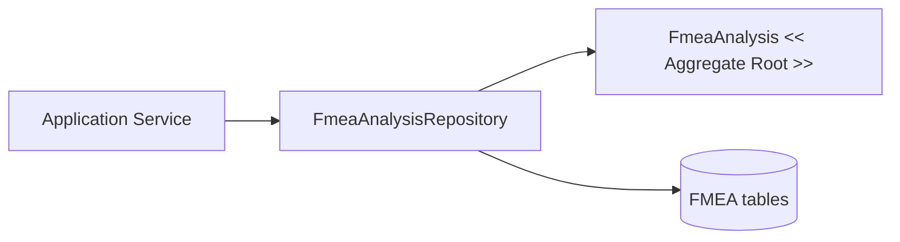

---




FmeaAnalysis = 애그리거트 루트  
FmeaItem, FunctionAnalysis, FailureMode, Cause, Effect, Action = 내부 구성요소  
RiskAssessment = Value Object  
Part, User, ECR = 다른 애그리거트라서 ID로 참조

repository는 루트 단위로 둔다.


## FMEA Analysis가 루트인 이유?

- 승인된 FMEA는 실패모드를 추가/수정할 수 없다.
- RiskAssessment는 severity, occurrence, detection이 1~10이어야 한다.
- FailureMode가 추가되면 위험도 계산이 가능해야 한다.
- RecommendedAction은 담당자, 기한, 상태 규칙을 가져야 한다.
- FMEA가 Close 상태면 Action을 추가할 수 없다.

## 애그리거트 -  팩토리로 사용하는 부분

1. fmea 생성
```java
public static FmeaAnalysis createPfmea(
        FmeaId id,
        String title,
        PartId targetPartId
) {
    return new FmeaAnalysis(id, title, FmeaType.PFMEA, targetPartId);
}
```

2. 실패 모드 생성 - Effect, Cause, RiskAssessment가 따라옴
```java
public class FailureModeFactory {
    public static FailureMode create(
            String description,
            List<Effect> effects,
            List<Cause> causes,
            RiskAssessment riskAssessment
    ) {
        return new FailureMode(description, effects, causes, riskAssessment);
    }
}
```
