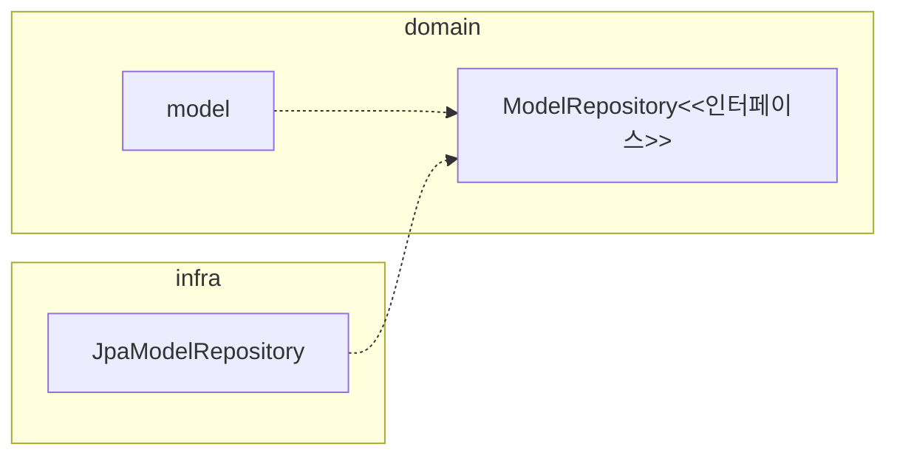
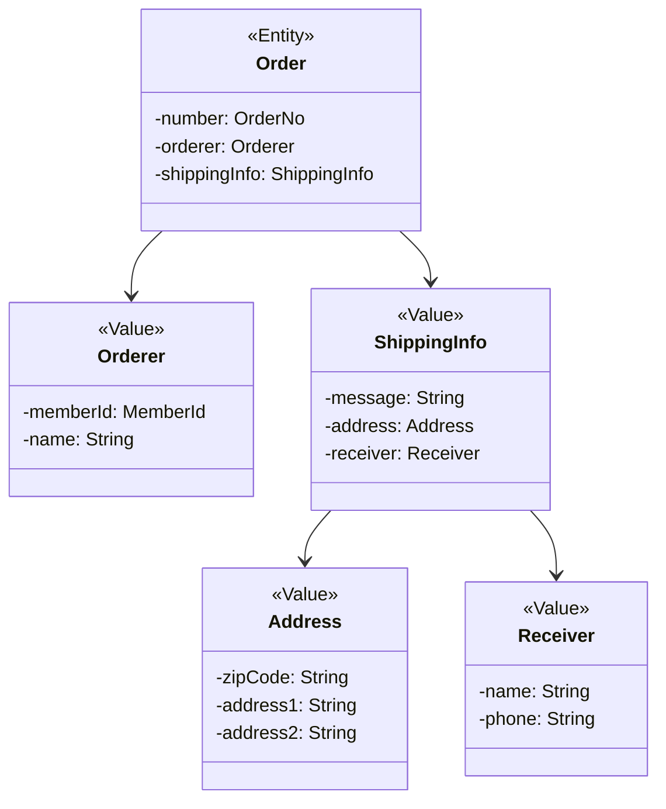
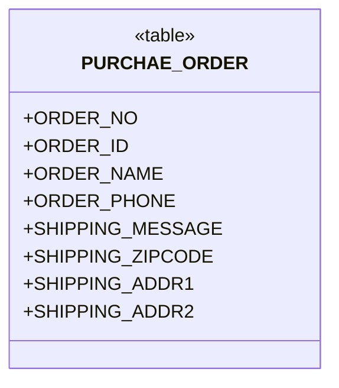
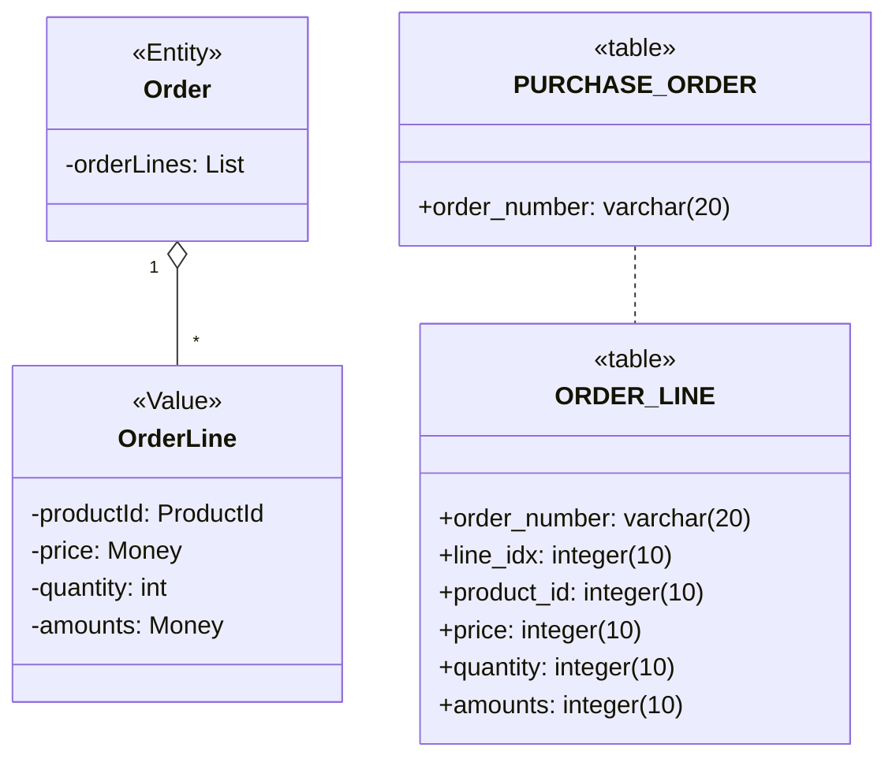
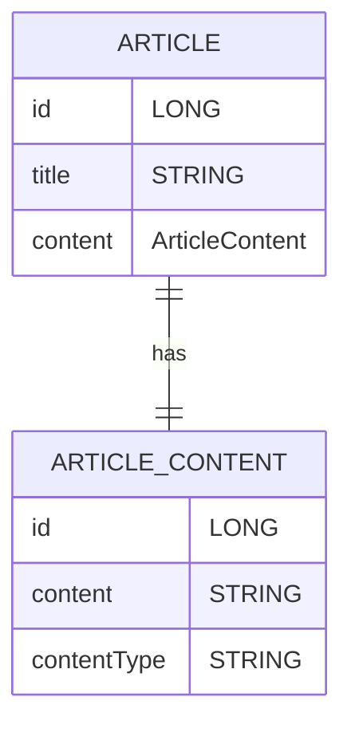
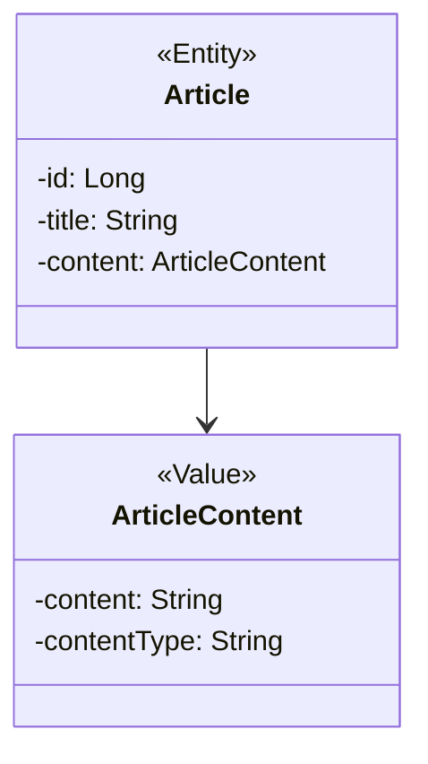
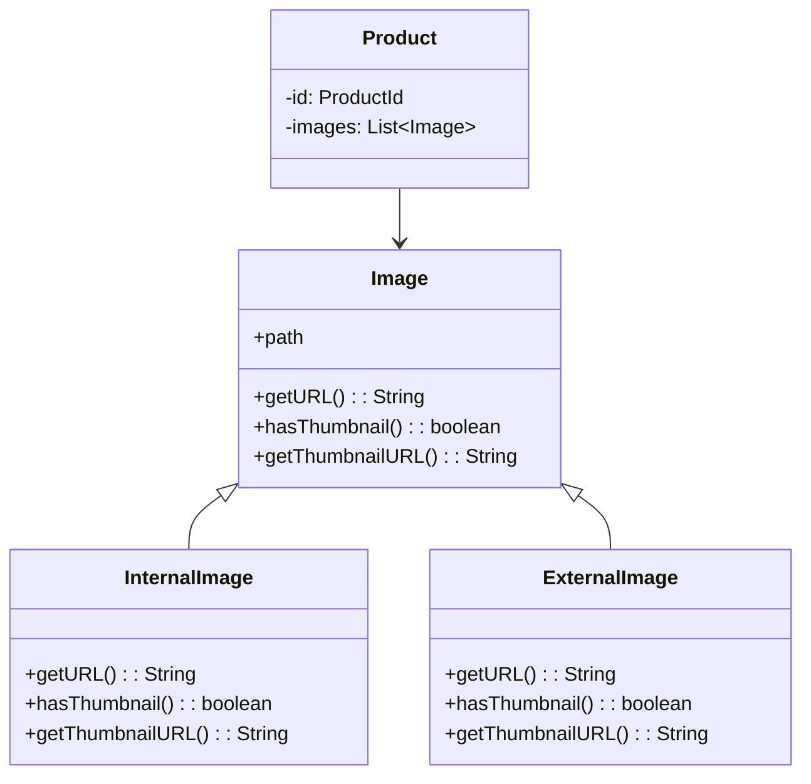

---
## 목차

1. [JPA를 이용한 리포지터리 구현](#41-JPA를-이용한-리포지터리-구현)
2. [스프링 데이터 JPA를 이용한 리포지터리 구현](#42-스프링-데이터-JPA를-이용한-리포지터리-구현)
3. [매핑 구현](#43-매핑-구현)
4. [애그리거트 로딩 전략](#44-애그리거트-로딩-전략)
5. [애그리거트 영속성 전파](#44-애그리거트-영속성-전파)
6. [식별자 생성 기능](#46-식별자-생성-기능)
7. [도메인 구현과 DIP](#47-도메인-구현과-DIP)
---
## 1. JPA를 이용한 리포지터리 구현

**ORM ?**
Object-Relational Mapping의 약자로 “객체-관계 매핑”을 의미한다. 즉 객체와 테이블을 자동으로 연결해주는 기술이다.


리포지터리는 애그리거트와 같이 도메인 영역에 속하고 구현한 클래스는 인프라스트럭쳐에 속한다.

리포지터리의 기본 기능
- ID로 애그리거트 조회하기 findById(); (규칙 findBy프로퍼티이름(프로퍼티 값))
- 애그리거트 저장하기 save();

```java
@Repository
//OrderRepository -> JpaRepository<Order, Long> 
//Spring이 EntityManager 기반 구현을 자동 생성해줌
public class JpaOrderRepository implements OrderRepository {
	//JPA의 “가장 원초적인 API”를 직접 사용하는 방식
	//모든 CRUD를 직접 구현해야 함
	@PersistanceContext
	private EntityManager entityManager;
	
	@Override
	public Order findById(OrderNo id) {
		return entityManager.find(Order.class.id);
	}
	
	@Override
	public void save(Order order) {
		entityManager.perisit(order);
	}
}
```

JPA 혹은 JPQL등의 사용으로 매세드 구현이 가능하다.

---
## 2. 스프링 데이터 JPA를 이용한 리포지터리 구현

스프링 데이터 JPA는 다음 규칙에 따라 작성한 인터페이스를 찾아 구현한 스프링 빈 객체를 자동 등록한다.
- org.springframework.data.repository.Repository<T, ID> 인터페이스 상속
- T는 엔티티 타입을 지정하고 ID는 식별자 타입을 지정

---
## 3. 매핑 구현

애그리거트와 JPA 매핑을 위한 기본 규칙
- 애그리거트 루트는 엔티티이므로 @Entity로 매핑 설정한다.

한 테이블에 엔티티와 밸류 데이터가 같이 있다면
- 밸류는 @Embeddable 매핑 설정한다.
- 밸류 파입 프로퍼티는 @Embedded로 매핑 설정한다.





```java
@Entity
@Table(name="purchase_order")
public class Order { // 루트 엔티티를 @Entity로 구현

	//Orderer는 밸류이므로 @Embedded로 생성
	@Embedded
	//매핑되는 본래 컬럼 이름이 다르므로 변경
	@AttributeOverrides(
		@AttributeOverrides(name="id", column=@Column(name="orderer_id"))
	)
	private MemberId memberId;
	
	...
}

@Embeddable
public class MemberId implements Serializable {
	//이 값이 어디서 왔는지 표기하는 의미는 가짐 (기능x, 테이블 x)
	@Column(name="member_id")
	private String id;
}
```

엔티티와 밸류의 생성자는 객체를 생성할 때 필요한 것을 전달 받는다.
ex) Receiver 밸류는 수취인 이름, 연락처를 받는다.
```java
public class Receiver {
	private String name;
	private String phone;
	
	public Receiver(String name, String phone) {
		this.name = name;
		this.phone = phone;
	}
	
	//불변 타입이면서 생성시 필요한 값을 받으므로, set 메서드 제공하지 않음!
	// 즉, 파라미터 없는 생성자 불필요 -> @Entity @Embeddable 사용불가
	// JPA 적용을 위한 기본 생성자 필요
	protected Receiver() {}
}
```

JPA는 필드와 매서드 두가지 방식으로 매핑을 처리한다.
매서드의 경우 get/set을 구현한다. 
이 때 의도가 보여야 하고 공개적이면 도메인 의도가 사라진다.
객체가 제공할 기능 중심으로 엔티티 구현하게끔 유도하려면 JPA 매핑 처리를 property가 아닌 필드 방식으로 하여 get/set 매서드를 구현하지 말아햐 한다.
```java
@Entity
@Access(AccessType.FIELD)
public class Order {
	@EmbeddedId
	private OrderNo number;
	
	@Column(name="state")
	@Enumerated(EnumType.STRING)
	private OrderState state;
	
	// cancel(), changeShippingInfo()... 도메인 기능
	// 필요한 get 매서드 제공공
}
```

두 개 이상의 프로퍼티를 가진 밸류 타입은 AttributeConverter를 사용해 변환한다.
```java
public interface AttributeConverter<X,Y> {
	//X는 밸류 타입, Y는 DB타입
	public Y convertToDatabaseColumn(X attribute);
	public X convertToEntityAttribute(Y dbData);
}

//모델에 출현하는 모든 Money 타입의 property에 대해 자동으로 적용한다.
@Converter(autoApply = true)
public class MoneyConverter implements AttributeConverter<Money, Integer> {
	
	@Override
	public Integer convertToDatabaseColumn(Money money) {
		return money == null ? null : money.getValue();
	}
	
	@Override
	public Money convertToEntityAttribute(Integer value) {
		return value == null ? null : new Money(value);
	}
}

@Entity
@Table(name="purchase_order")
public class Order {
	@Column(name = "total_amounts")
	private Money totalAmounts; // MoneyConverter 적용해서 값 변환
	//autoApply가 false일 경우
	//@Convert(converter = MoneyConverter.class)
	//private Money totalAmounts;
}
```

Order와 OrderLine의 경우 1:N이므로 List타입을 이요해 컬렉션을 프로퍼티로 지정한다.
별도 테이블을 매핑할 경우 @ElementCollection과  @CollectionTable을 함께 사용한다.


```java
@Entity
@Table(name="purchase_order")
public class Order {
	@EmbeddedId
	private OrderNo number;
	
	...
	
	@ElementCollection(fetch = FetchType.EAGER)
	@CollectionTable(name = "order_line", joinColumns = @JoinColumn(name="order_number")) //2개 이상일 경우 배열 사용
	@OrderColumn(name="line_idx")
	private List<OrderLine>orderLines;
}

@Embeddable
public class OrderLine {
	//list 타입 자체가 index를 가지고 있음
	@Embedded
	private ProductId productId;
	
	@Column(name = "price")
	private Money price;
	
	@Column(name = "quantity")
	private int quantity;
	
	@Column(name = "amounts")
	private Money amounts;
}
```

이처럼 별도 테이블로 설정이 아닌 한 개의 컬럼에 저장해야하는 경우 AttributeConverter를 사용해 매핑 가능한다. 이 경우 새로운 밸류 타입을 추가해야한다.
```java
public class EmailSet {
	private Set<Email> emails = new HashSet<>();
	
	public EmailSet(Set<Email> emails) {
		//참조 x, 값 복사
		this.emails.addAll(emails);
	}
	
	public Set<Email> getEmails() {
		return Collections.unmodifiableSet(emails);
	}
}

public class EmailSetConverter implements AttributeConverter<EmailSet, String> {
	@Override
	public String convertToDatabaseColumn(EmailSet attribute) {
		if(attribute == null) return null;
		return attribute.getEmails().stream().map(email -> email.getAddress())
				.collect(Collectors.joining(","));
	}
	
	@Override
	public EmailSet converToEntityAttribute(String dbData) {
		if(dbData == null) return null;
		String[] emails = dbData.split(",");
		Set<Email> emailSet = Attrays.stream(emails).map(value->new Email(value))
								.collect(toSet());
		return new EmailSet(emailSet);
	}
}

//EmailSet이 converter를 사용하게 설정
@Column(name = "emails")
@Converter(converter = EmailSetConverter.class)
private EmailSet emailSet;
```

식별자 자체를 밸류 타입으로 만들 수 있다. @Id 대신 @EmbeddedId 이너테이션을 쓴다.
식별자를 밸류 타입으로 만들 경우 기능을 추가할 수 있다는 장점이 있다.
```java
@Entity
@Table(name="purchase_order")
public class Order {
	@EmbeddedId
	private OrderNo number;
}

@Embeddable
public class OrderNo implements Serializable { //식별자 타입은 Serializalbe 타입
	@Column(name="order_number")
	private String number;
}
```

애그리거트에 속한 객체가 밸류인지 엔티티인지 구분하는 방법은 고유 식별자를 갖는지 확인하는 것이다.(테이블 식별자 != 애그리거트 구성요소 식별자)

atricle_content는 엔티티가 아니다. 연결을 위해 id가 존재하지만 관리를 위한 것이 아니다.

따라서 실제 모델은 다음과 같다. 밸류를 한 테이블에 지정하기 위해 @SecondaryTable과 @AttributeOverride를 사용한다.
```java
@Entity
@Table(name = "article")
@SecondaryTable(
	name="article_content",
	pkJoinColumns=@PrimaryKeyJoinColumn(name="id")
)
public class Article {
	@Id
	@GeneratedValue(strategy = GenerationType.IDENTITY)
	private Long id;
	
	@AttributeOverrides(
		{
			@AttributeOverride(
				name="content",
				column=@Column(table="article_content", name="content")
			),
			@AttributeOverride(
				name="contentType",
				column=@Column(table="article_content", name="content_type")
			)
		}
	)
	@Embedded
	private ArticleCOntent content;
}
```

JPA는 @Embaddable 타입의 클래스 상속 매핑을 지원하지 않는다. 따라서 @Entity를 사용해 상속 매핑으로 처리해야 한다.
하위 클래스를 매핑하기 위한 설정
- @Inheritance 애너테이션 적용
- strategy 값으로 SINGLE_TABLE 사용
- @DiscriminatorColumn 애너테이션을 이용한 타입 구분용으로 사용할 컬럼 지정
상속받은 클래스는 @Entity와 @Discriminator를 사용해 매핑을 설정한다.

```java
@Entity
@Inheritance(startegy=InheritanceType.SINGLE_TABLE)
@DiscriminatorColumn(name="image_type")
@Table(name="image")
public abstract class Image {
	...
}

@Entity
@DiscriminatorValue("II")
public class InternalImage extends Image {
	...
}

@Entity
@DiscriminatorValue("EI")
public class ExternalImage extends Image {
	...
}
```
@OneToMany에서 clear()를 호출하면  select로 로딩 후 각 개별 delte를 실행한다. (4개의 이미지라면 1회 조회와 4회 delete)
이 문제를 해소하기 위해 상속을 포기하고 @Embeddable로 매핑된 단일 클래스를 사용할 수 있다.

성능 상의 이슈로 집합 연관은 피하지만 유리한 경우에는 ID 참조를 이용한 단방향 집합 연관을 적용할 수 있다.
```java
@Entity
@Table(name="product")
public class Product {
	@EmbeddedId
	private ProductId id;
	
	//매핑에 사용된 조인 테이블의 데이터도 함께 삭제
	@ElementCollection
	@CollectionTable(
		name="product_category",
		joinColumns=@JoinColumn(name="product_id")
	)
	private Set<CategoryId> categoryIds;
	
}
```

---
## 4. 애그리거트 로딩 전략

애그리거트에 속한 **모든 객체가 모여야** 완전한 하나가 된다.
애그리거트의 조회 방식을 즉시 로딩(FetchType.EAGER)로 설정하면 된다. (컬렉션에서 전략을 설정할 경우 로딩 방식에 문제가 생길 수 있다.)
```java
@Entity
@Table(name="product")
public class Product {
	@OneToMany(
		cascade = {CascadeType.PERSIST, CascadeType.REMOVE},
		orphanRemoval = true,
		fetch = FetchTYpe.EAGER
	)
	@JoinColumn(name="product_id")
	@OrderColumn(name="list_idx")
	private List<Image> images = new ArrayList<>();
	
	@ElementCollection(fetch = FetchType.EAGER)
	@CollectionTable(name="product_option",
		joinColumns = @JoinColumn(name="product_id"))
	@OrderColumn(name="list_idx")
	private List<Option> options = new ArrayList<>();
}

select
	p.product_id, ..., img.product_id, img.image_id, img.list_idx, img.image_id..,
	opt.product_id, opt.option_title, opt.option_value, opt.list_idx
from
	product p
	left outer join image img on p.prouct_id = img.product_id
	left outer join product_option opt on p.product_id = opt.product_id
where p.product_id = ?

//쿼리의 결과는 카타시안 조인을 사용하고 중복을 발생시킨다.
```

애그리거트가 온전해야 하는 이유
- 상태를 변경하는 기능을 실행할 때 애그리거트 상태가 완전해야하기 때문
- 표현 영역에서 애그리거트의 상태 정보를 보여주기 위해

지연 로딩을 사용하여 실제로 상태를 변경하는 시점에 로딩
```java
@Transactional
public void removeOptions(ProductId id, int optIdxToBeDeleted) {
	//Product를 로딩. 컬렉션은 지연 로딩으로 설정했다면, Option은 로딩하지 않음
	Product product = productRepository.findById(id);
	//트랜잭션 범위이므로 지연 로딩으로 설정한 연관 로딩 가능
	product.removeOption(optIdxToBeDeleted);
}

@Entity
public class Product {
	@ElementCollection(fetch=FetchType.LAZY)
	@CollectionTable(name="product_option",
		joinColumns=@JoinColumn(name="product_id")
	)
	@OrderColumn(name="list_idx)
	private List<Option> options = new ArrayList<>();
	
	public void removeOption(int optIdx) {
		//실제 컬렉션에 접근할 때 로딩
		this.options.remove(optIdx);
	}
}
```

---
## 5. 애그리거트 영속성 전파

애그리거트의 완전한 상태는 루트의 조회 뿐 아니라 저장 및 삭제 때도 하나로 처리해야 한다.
- 저장 매서드는 애그리거트 루트만 저장하면 안 되고 애그리거트에 속한 모든 객체를 저장
- 삭제 메서드는 애그리거트 루트뿐 아니라 애그리거트에 속한 모든 객체를 삭제

@Embeddable의 경우 함께 저장되고 삭제되므로 cascade 속성을 추가할 필요 없다.
@Entity 타입의 매핑은 cascade 속성을 사용해야한다. (CascadeType.PERSIST, CascadeType.REMOVE)

```java
@OneToMany(cascade = {CascadeType.PERSIST, CascadeType.REMOVE},
			orphanRemoval = true
)
@JoinColumn(name="product_id")
@OrderColumn(name="list_idx")
private List<Image> images = new ArrayList<>();
```

---
## 6. 식별자 생성 기능

식별자를 생성하는 세가지 방식
- 사용자가 직접 생성
- 도메인 로직으로 생성
- DB를 이용한 일련번호 사용

식별자 생성 규칙은 도메인 규칙이므로 도메인 영역에 위치시켜야 한다.
ex) @Service에 ID 생성 함수
ex) 리포지터리 인터페이스에 식별자 생성 메서드를 추가(저장 이후에 Id를 알 수 있음)

---
## 7.도메인 구현과 DIP

4장에서 구현한 Repository는 DIP원칙을 어기고 JPA에 특화된 @Entity, @Table, @Id, @Column등의 애너테이션을 사용하여 JPA에 의존하고 있다.

DIP를 완벽하게 지키면 좋겠지만 개발 편의성과 실용성을 가져가면서 구조적인 유연함은 유지하는 한해서 구현하는게 좋다.

Q. DIP를 늘 의식하면서 할 수 는 없는데.. Entity구현에 먼저 초점을 둬야 하는 것인가?
-> 도메인 모델(의미와 규칙)을 먼저 만들고, 그다음에 DIP로 경계를 정리한다.
	1. 도메인을 어떻게 모델링할까? -> 도메인부터 생각
	2. 이걸 어떻게 저장할까? (JPA 등장) -> repository에 의존하면 dip 깨짐
	3. DIP를 어디까지 지킬까? -> dip를 어느정도 지켜나감
