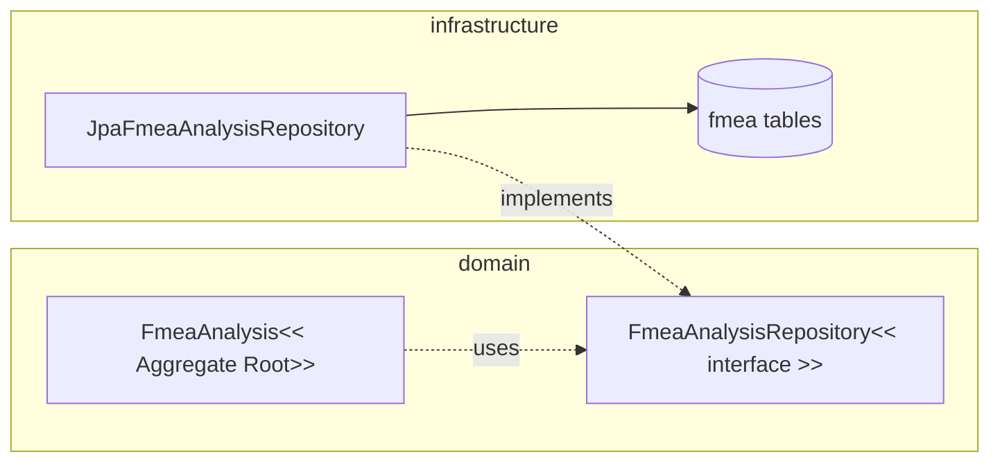
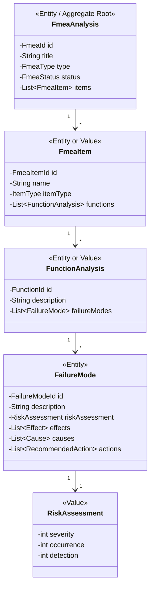

## FMEA Repository 구조


```java
public interface FmeaAnalysisRepository {
    FmeaAnalysis findById(FmeaId id);
    void save(FmeaAnalysis fmea);
}

public interface JpaFmeaAnalysisRepository
        extends Repository<FmeaAnalysis, FmeaId>, FmeaAnalysisRepository {
}

@Repository
public class JpaFmeaAnalysisRepository implements FmeaAnalysisRepository {

    @PersistenceContext
    private EntityManager em;

    @Override
    public FmeaAnalysis findById(FmeaId id) {
        return em.find(FmeaAnalysis.class, id);
    }

    @Override
    public void save(FmeaAnalysis fmea) {
        em.persist(fmea);
    }
}
```

## 애그리거트 매핑 방향


```java
@Entity
@Table(name = "fmea_analysis")
@Access(AccessType.FIELD)
public class FmeaAnalysis {

    @EmbeddedId
    private FmeaId id;

    @Column(name = "title")
    private String title;

    @Enumerated(EnumType.STRING)
    @Column(name = "type")
    private FmeaType type;

    @Enumerated(EnumType.STRING)
    @Column(name = "status")
    private FmeaStatus status;

    @OneToMany(
        cascade = {CascadeType.PERSIST, CascadeType.REMOVE},
        orphanRemoval = true
    )
    @JoinColumn(name = "fmea_id")
    @OrderColumn(name = "item_idx")
    private List<FmeaItem> items = new ArrayList<>();

    protected FmeaAnalysis() {
    }

    public void addFailureMode(
            FmeaItemId itemId,
            FunctionId functionId,
            FailureMode failureMode
    ) {
        verifyEditable();
        FmeaItem item = findItem(itemId);
        item.addFailureMode(functionId, failureMode);
    }

    private void verifyEditable() {
        if (status == FmeaStatus.APPROVED || status == FmeaStatus.CLOSED) {
            throw new IllegalStateException("승인/종료된 FMEA는 수정할 수 없습니다.");
        }
    }
}

@Embeddable
public class RiskAssessment {

    @Column(name = "severity")
    private int severity;

    @Column(name = "occurrence")
    private int occurrence;

    @Column(name = "detection")
    private int detection;

    protected RiskAssessment() {
    }

    public RiskAssessment(int severity, int occurrence, int detection) {
        validate(severity);
        validate(occurrence);
        validate(detection);
        this.severity = severity;
        this.occurrence = occurrence;
        this.detection = detection;
    }

    public int rpn() {
        return severity * occurrence * detection;
    }

    private void validate(int value) {
        if (value < 1 || value > 10) {
            throw new IllegalArgumentException("평가값은 1~10 사이여야 합니다.");
        }
    }
}
```
