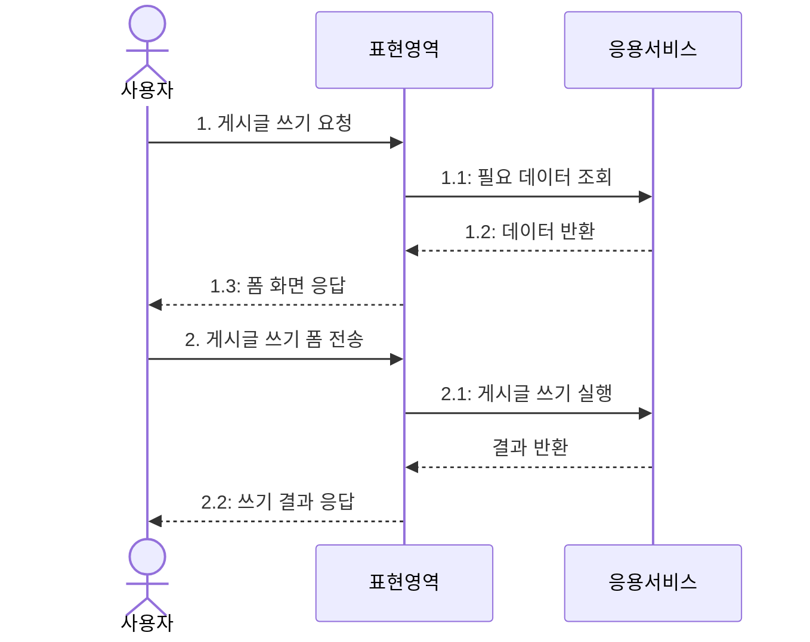
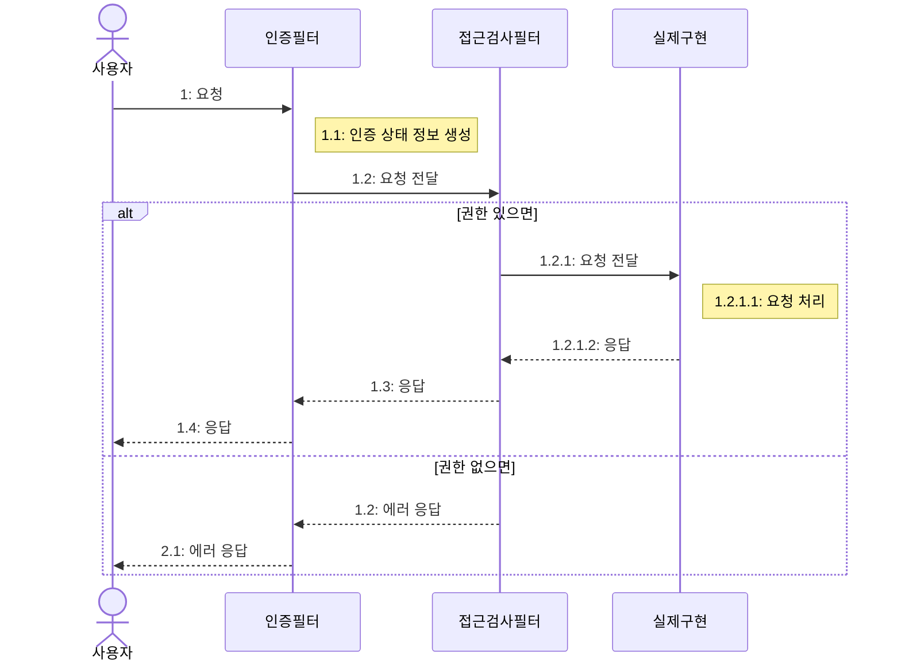

 ---
 ## 목차
 1. [표현 영역과 응용 영역](##61-표현-영역과-응용-영역)
 2. [응용 서비스의 역할](##62-응용-서비스의-역할)
 3. [응용 서비스의 구현](##63-응용-서비스의-구현)
 4. [표현 영역](##64-표현-영역)
 5. [값 검증](##65-값-검증)
 6. [권한 검사](##66-권한-검사)
 7. [조회 전용 기능과 응용 서비스](##67-조회-전용-기능과-응용-서비스)
 ---
## 6.1 표현 영역과 응용 영역

사용자에게 기능을 제공하려면 도메인과 사용자를 연결해 줄 표현 영역과 응용 영역이 필요하다.


표현 영역은 사용자의 요청을 해석하고, 응용 영역은 알맞은 기능을 제공하는 서비스를 실행하고 도메인 영역은 원하는 기능을 제공한다.

---
## 6.2 응용 서비스의 역할

응용 서비스는 표현 영역과 도메인 영역을 연결해 주는 창구 역할을 하며 주로 도메인 객체 간의 흐름을 제어하기 때문에 단순한 형태를 갖는다.
```java
public Result doSomeFunc(SomeReq req) {
	//1. 리포지터리에서 애그리거트를 구한다.
	SomeAgg agg = someAggRepository.findById(req.getId());
	checkNull(agg);
	
	//2. 애그리거트의 도메인 기능을 실행한다.
	agg.doFunc(req.getValue());
	
	//3. 결과를 반환한다.
	return createSuccessResult(agg);
}

//새로운 애그리거트 생성 서비스

//1. 데이터 중복 등 데이터가 유효한지 검사한다.
//2. 애그리거트를 생성한다.
//3. 리포지터리에 애그리거트를 저장한다.
//4. 결과를 리턴한다.
```

트랜잭션 처리도 담당하여 도메인 상태 변경을 처리한다.

도메인 로직은 응용 서비스에 넣으면 복잡해지고 코드 중복, 로직 분산 등 품질에 영향을 줄 수 있다.
ex) 비밀번호를 올바르게 입력했는지 확인하는 것

---
## 6.3 응용 서비스의 구현

파사드(facade) : 여러 복잡한 객체나 기능을  
**하나의 단순한 인터페이스로 감싸서 쉽게 사용할 수 있게 해주는 디자인 패턴**

응용 서비스를 생성할 경우 크기를 고려한다.
- 한 응용 서비스 클래스에 도메인의 모든 기능 구현하기
- 구분되는 기능별로 응용 서비스 클래스 따로 구현하기

인터페이스가 필요한 경우는 구현 클래스가 여러개인 경우이다. 따라서 명확하게 필요하기 전까지는 불필요하게 만들 필요가 없다. (TDD의 경우는 인터페이스부터 개발)

요청 파라미터가 두 개 이상 존재하면 데이터 전달을 위한 별도 클래스를 사용하는 것이 편리하다.

응용 서비스 자체에서 애그리거트 자체를 리턴하면 코딩은 편해도 도메인 로직 실행을 응용 서비스와 표현 영역 두 군데에서 할 수 있어 코드 응집도를 낮춘다.

응용 서비스의 파라미터 타입을 결정할 때 표현 영역과 관련된 타입을 사용하면 안된다. HttpServletRequest나 HttpSession을 응용 서비스에 파라미터로 전달하면 안된다. (컨트롤러에서 필요한거 추출해서 넘겨야 함) 서비스만 단독으로 테스트하기 어려워지고 표현 영역의 변경에 따른 서비스 구현도 함께 변경이 되기 때문이다. (지금까지 진짜 편하게 코딩했구나..)

---
## 6.4 표현 영역

표현 영역의 책임
- 사용자가 시스템을 사용할 수 있는 흐름(화면)을 제공하고 제어한다.
- 사용자의 요청을 알맞은 응용 서비스에 전달하고 결과를 사용자에게 제공한다.
- 사용자의 세션을 관리한다.



응용 서비스의 실행 결과를 사용자에게 알맞은 형식으로 제공하는 것도 표현 영역의 몫이다.

---
## 6.5 값 검증

값 검증은 원칙적으로 응용 서비스에서 처리한다. 폼에 입력한 값이 잘못된 경우 Errors나 BindingResult를 사용한다.

```java

//모든 에러를 한 번에 알 수 없는 단점이 생김
} catch() {
	//
} catch() {
	//
}
	//
	
//if-else문을 통해 각각을 체크해서 하나의 익셉션으로 모아 발생시킴
List<ValidationError> errors = new ArrayList<>();
...
if() {
	errors.add(...);
} else {
	if() errors.add(...);
	if() errors.add(...);
	...
}

if(!errors.isEmpty()) throw new ValidationErrorException(errors);
```

스프링과 같은 프레임워크는 값 검증을 위한 Validator 인터페이스를 별도로 제공한다.
```java
@Controller
public class Controller {
	@PostMapping("/member/join")
	public String join(JoinRequest joinRequest, Errors errors) {
		new JoinRequestValidator().validate(joinRequest, errors);
		
		if(errors.hasErrors()) return formView;
		
		try {
			joinService.join(joinRequest);
			return successView;
		} catch( DuplicateException ex ) {
			errors.rejectValue(ex.getPropertyName(), "duplicate");
			return formView;
		}
	}
}
```

구현의 편리함을 위해 역할을 나누어 검증을 수행할 수 있다.
- 표현 영역 : 필수 값, 값의 형식, 범위 등을 검증한다.
- 응용 서비스 : 데이터의 존재 유무와 같은 논리적 오류를 검증한다.

---
## 6.6 권한 검사

권한 검사는 표현 영역, 응용 서비스, 도메인 모두 수행할 수 있다.

표현 영역은 **인증된 사용자 인지** 검사를 한다.
서블릿 필터에서 사용자의 인증 정보를 생성하고 인증 여부를 검사한다.

서블릿 필터 : 웹 애플리케이션에서 **HTTP 요청(Request)과 응답(Response)을 가로채서 공통 기능을 처리하는 객체**



스프링 시큐리티의 AOP를 활용해 응용 서비스에서 검사가 가능하다 (hasRole("ADMIN")등..)

응용 서비스의 메서드 수준에서 권한 검사가 불가능하면 개별 도메인 단위로 검사를 해야하고 이 경우 구현이 복잡해진다.

---
## 6.7 조회 전용 기능과 응용 서비스

단순 조회의 경우 기능 호출 외 추가적인 로직이 없다면 굳이 서비스를 만들 필요 없이 표현 영역에서 사용해도 문제가 없다.
