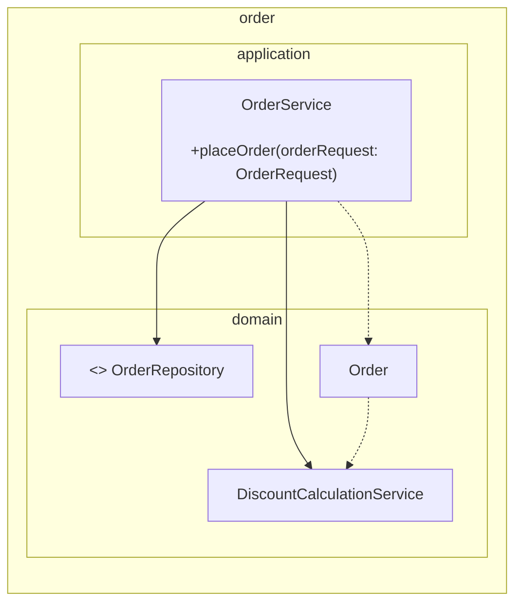
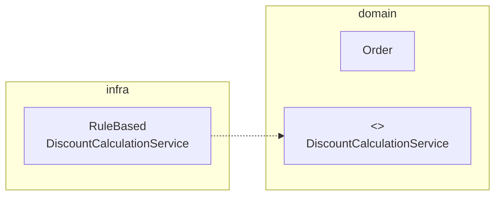

 ---
## 목차

1. [여러 애그리거트가 필요한 기능](#71-여러-애그리거트가-필요한-기능)
2. [도메인 서비스](#72-도메인-서비스)

---
## 7.1 여러 애그리거트가 필요한 기능

결제 금액 계산 로직에 필요한 애그리거트 : 상품, 주문, 할인 쿠폰, 회원

한 애그리거트에 넣기 애매한 도메인 기능을 억지로 특정 애그리거트에 구현하면 안된다. 자신의 책임 범위를 넘어서는 기능을 구현하기 때문에 코드가 길어지고 외부에 대한 의존이 높아지게 되며 코드를 복잡하게 만들어 수정을 어렵게 한다.

---
## 7.2 도메인 서비스

도메인 영역에 위치한 도메인 로직을 표현할 때 사용
- 계산 로직 : 여러 애그리거트가 필요한 계산 로직이나, 한 애그리거트에 넣기에는 다소 복잡한 계산 로직
- 외부 시스템 연동이 필요한 도메인 로직 : 구현하기 위해 타 시스템을 사용해야 하는 도메인 로직

도메인 서비스는 상태 없이 로직만 구현하며 필요한 상태는 다른 방법으로 전달 받는다.

도메인 서비스는 도메인 로직을 수행하며 응용 로직을 수행하진 않는다. 트랜잭션 같은 로직은 응용이므로 응용 서비스에서 처리해야한다. (애그리거트 상태 변경을 확인하면 구분하기 쉬움)

외부 시스템과 연동이 필요할 때 http api 호출도 가능하지만 도메인 로직으로 볼 수 있다. 인터페이스를 도메인 로직 관점에서 작성할 수 있으며 연동한다는 관점으로 작성하지 않는다.
```java
public interface SurveyPremissionChecker {
	boolean hasUserCrationPermission(String userId);
}

public class CreateSurveyService {
	private SurveryPermissionChecker permissionChecker;
	
	public long createSurvey(CreateSurveyRequest req) {
		validate(req);
		//도메인 서비스를 이용해서 외부 시스템 연동을 표현
		if(!permissionCheker.hasUserCreationPermission(req.getRequestorId())) {
			throw new NoPermissionException();
		}
	}
}
```

도메인 서비스는 도메인 로직을 표현하므로 도메인 서비스의 위치는 다른 도메인 구성요소와 동일한 패키지에 위치한다.


도메인 서비스의 로직이 고정되어 있지 않은 경우 도메인 서비스 자체를 인터페이스로 구현하고 클래스를 둘 수도 있다.

