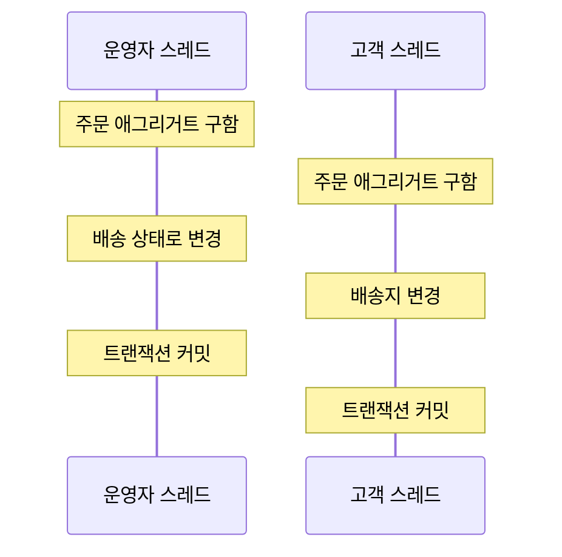
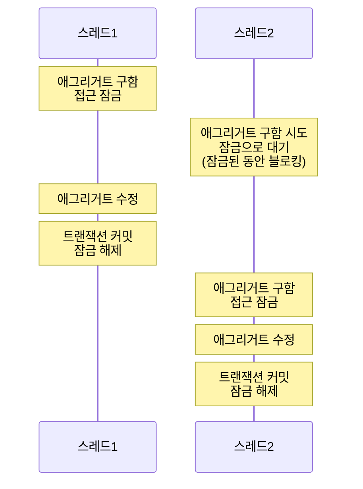
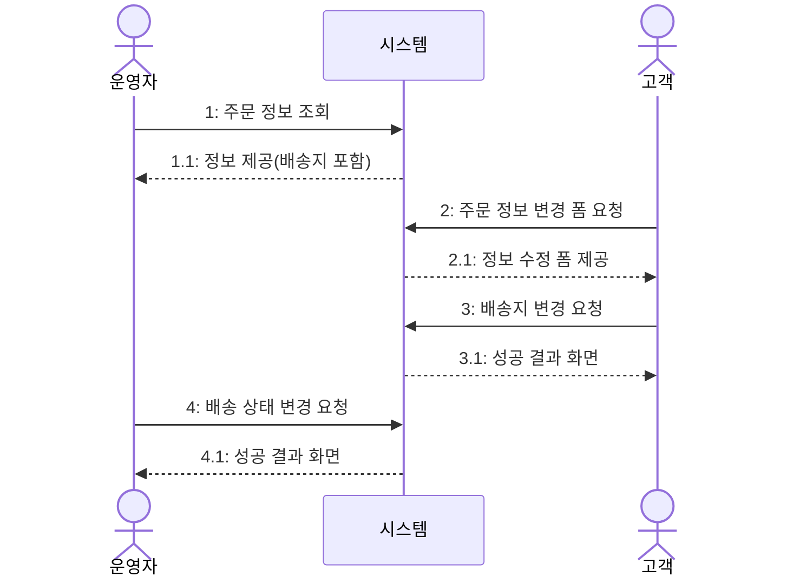

 ---
## 목차

1.[애그리거트와 트랜잭션](##81-애그리거트와-트랜잭션)
2.[선점 잠금](##82-선점-잠금)
3.[비선점 잠금](##83-비선점-잠금)
4.[오프라인 선점 잠금](##84-오프라인-선점-잠금)

---
## 8.1 애그리거트와 트랜잭션

한 애그리거트를 두 사용자가 동시 변경할 경우 트랜잭션이 필요하다.


위 경우 기존 배송지를 가지고 배송 상태를 변경 했는데 기존 배송지가 변경 되어 애그리거트의 일관성이 깨진다.

문제를 막기 위해 두 가지 중 하나를 해야한다.
- 운영자가 배송지 정보를 조회하고 상태를 변경하는 동안, 고객이 애그리거트를 수정하지 못하게 막는다.
- 운영자가 배송지 정보를 조회한 이후에 고객이 정보를 변경하면, 운영자가 애그리거트를 다시 조회한 뒤 수정하도록 한다.

---
## 8.2 선점 잠금

선점 잠금은 먼저 애그리거트를 구한 스레드가 애그리거트 사용이 끝날 때까지 다른 스레드가 해당 애그리거트를 수정하지 못하게 막는 방식이다.



애그리거트 충돌을 방지할 수 있다. 위와 같이 흐르면 배송 상태로 변경되어 고객은 배송지를 변경할 수 없다.

선점 잠금은 DBMS가 제공하는 행단위 잠금을 사용해서 구현한다. JPA EntityManger는 LockModeType을 인자로 받는 find() 메서드를 제공한다. LockModeTYpe.PESSIMISTIC_WRITE 값으로 전달하면 선점 잠금 방식을 적용할 수 있다.
```java
Order order = entityManager.find(Order.class, orderNo, LockModeType.PESSIMISITC_WRITE);

//하이버 네이트의 경우 'for update' 쿼리를 이용해 선점 잠금을 수현한다.
//스프링 데이터 JPA는 @Lock 애너테이션을 사용해서 잠금 모드를 지정한다.
public interface MemberRepository extends Repository<Member, MemberId> {
	@Lock(LockModeType.PESSIMISTIC_WRITE)
	@Query("select m from Member m where m.id = :id")
	Optional<Member> findByIdForUpdate(@Param("id")MemberId memberId);
}
```

선점 잠금 기능 사용 시 잠금 순서에 따른 교착 상태가 발생하지 않도록 주의해야 한다. 따라서 잠금을 구할 때 최대 대기 시간을 지정해야 한다.
```java
Map<String, Object> hints = new HashMap<>();
//밀리초 단위, 사용중인 DBMS가 힌트를 지원하는지 확인 필요
hints.put("javax.persistence.lock.timeout", 2000);
Order order = entityManager.find(Order.class, orderNo, LockModeType.PESSIMISTIC_WRITE, hints);

//혹은
public interface MemberRepository extends Repository<Member, MemberId> {
	@Lock(LockModeType.PESSIMISTIC_WRITE)
	@QueryHints({
		@QueryHint(name="javax.persistence.lock.timeout", value="2000")
	})
	@Query("select m from Member m where m.id = :id")
	Optional<Member> findByIdForUpdate(@Param("id")MemberId memberId);
}
```

---
## 8.3 비선점 잠금



배송 상태를 변경할 때 고객이 배송지를 변경하는 상황을 선점 방식으로 해결할 수 없다. 이 경우 비선점 잠금을 사용한다.

동시에 접근하는 것을 막는 대신 변경한 데이터를 실제 DBMS에 반영하는 시점에 변경 가능 여부를 확인하는 방식이다.

비선점 잠금을 사용하기 위해 애그리거트에 버전으로 사용할 숫자 타입 프로퍼티를 추가해야한다.
(1씩 증가 함)
```sql
UPDATE aggtable SET version = version + 1, colx = ?, coly = ?
WHERE aggid = ? and version = (현재버전) version
```

JPA는 @Version애너테이션을 이용해 버전을 사용한다.

비선점 잠금을 위한 쿼리를 실행할 때 변경이 0이면 이미 누군가 앞서 데이터를 수정한 것이다. 트랜잭션 종료 시점에 익셉션이 발생한다.

프레임 워크 OptimisticLockingFailureException은 거의 동시에 애그리거트의 수정이 있다는 것과
응용 서비스의 VersionConflictException은 이미 누군가 애그리거트를 수정했다는 것을 의미한다.

루트 앤티티가 아닌 다른 앤티티의 값만 변경 될 경우 루트 앤티티의 버전을 증가시키지 않는다. 따라서 강제로 버전 값을 증가시키는 잠금 모드를 사용한다.
```java
@Repository
public class JpaOrderRepository implements OrderRepository {
	@PersistenceContext
	private EntityManager entityManager;
	
	@Override
	public Order findByIdOptimisticLockMode(OrderNo id) {
		//앤티티 상태 변경 유무와 관련 없이 트랜잭션 종료 시점에 값 증가 처리
		return entityManager.find(
			Order.class, id, LockModeType.OPTIMISTIC_FORCE_INCREMENT);
		)
	}
}
```

---
## 8.4 오프라인 선점 잠금

아예 누군가 선점했을 경우 수정조차 못하게 하려면 오프라인 선점 잠금 방식을 사용해야한다. 

여러 트랜잭션에 걸쳐 동시 변경을 막는데 트랜잭션을 시작할 때 오프라인 잠금을 선점하고 마지막 트랜잭션에서 해제한다. 다만, 마지막에 수정 요청을 완료하여 오프라인 잠금을 해제하지 않는 경우가 생길 수 있으므로 유효 시간을 가지게 해야한다.

오프라인 선점 잠금은 4가지 기능을 필요로 한다.
- 선점 시도
- 잠금 확인
- 잠금 해제
- 잠금 유효시간

위 기능을 LockManager 에서 구현하는 기능은 다음과 같다.
```java
public interface LockManager {
	//ex) domain.Article, 10
	LockId tryLock(String type, String id) throws LockException;
	
	void checkLock(LockId lockId) throws LockException;
	
	void releaseLock(LockId lockId) throws LockException;
	
	void extendLockExpiration(LockId lockId, long inc) throws LockException;
}

//잠금을 해제하거나 유효한지 검사하거나 유효 시간을 늘릴 때 LockId를 사용한다.
public class LockId {
	private String value;
	public LockId(String value) {
		this.value = value;
	}
	public String getValue() {
		return value;
	}
}
```

